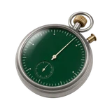

# ⏰ Runner

## Profile

- Repository: [nocoo/runner](https://github.com/nocoo/runner)
- Website: No current website verified; navigation opens the repository.
- Website evidence: Not applicable
- Category: tools
- Archived repository: No; [repository status evidence](../sources/repository-status-2026-09-06.json)
- English: Declare a schedule and let your Mac run your AI jobs through launchd.
- Chinese: 声明任务日程，交给 Mac 的 launchd 定时运行 AI 工作。
- Profile section: Recent Projects
- Profile revision: `9a7ad63e1e96428f9dcd12214bcdbd470b3b51c6`
- Repository revision inspected: `3bd26f260c1dedf63faf4a616421b8592b975be0`

## Current logo

- Type: Original project artwork, copied without modification
- Subject: Green digital glyph
- [Source](https://github.com/nocoo/runner/blob/3bd26f260c1dedf63faf4a616421b8592b975be0/logo.png): `logo.png`
- [Preserved asset](../../public/logos/originals/runner.png)
- Original dimensions: 2048 × 2048
- Original size: 7269302 bytes
- SHA-256: `2f87f9f05f3f2fe6ca573cf0504a9414396b83f6bb675f4b547e8462cc50aa3b`
- Locally modified source: No
- Display derivatives: 32, 64, 160, and 1024 px WebP; contain-fit, transparent padding, no recoloring or cropping.

## Current palette

| Role | Value | Evidence |
| --- | --- | --- |
| primary | `#14501f` | Preserved project artwork, dominant colored pixels |
| background | `#020202` | Preserved project artwork, border pixel |
| accent | `#2b9946` | Preserved project artwork, sampled pixel |
| accent | `#3deb71` | Preserved project artwork, sampled pixel |

Theme tokens take precedence. Additional colors are sampled from the preserved artwork. A transparent background means the source does not define an opaque background; the gallery's surrounding paper is not part of the project palette.

## Future family notes

Keep this asset as the phase-one baseline. A future family version should use a recognizable animal, one principal hue, and restrained multicolored geometric fragments.

Use head portraits for large animals and optionally full-body poses for small animals. Compare artwork, app icon, sidebar, and favicon sizes in both themes before adopting a replacement. No new logo is generated in phase one.
