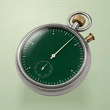

# ⏰ Runner

## Profile

- Repository: [nocoo/runner](https://github.com/nocoo/runner)
- Website: No current website verified; navigation opens the repository.
- Website evidence: Not applicable
- Category: tools
- Archived repository: No; [repository status evidence](../sources/repository-status-2026-09-06.json)
- English: Declare a schedule and let your Mac run your AI jobs through launchd.
- Chinese: 声明任务日程，交给 Mac 的 launchd 定时运行 AI 工作。
- Profile section: Recent Projects
- Profile revision: `9a7ad63e1e96428f9dcd12214bcdbd470b3b51c6`
- Repository revision inspected: `a5d786175358dee245773bd98af83eef4bbf5689`

## Project goal

Schedule shell commands, OpenCode prompts, and HTTP tasks on a Mac, then inspect their local run history and output through a CLI and Dashboard.

在 Mac 上定时执行 shell、OpenCode 和 HTTP 任务，通过 CLI 与本地 Dashboard 查看运行历史和输出。

- [中文 README](https://github.com/nocoo/runner/blob/main/README.md) · [English README](https://github.com/nocoo/runner/blob/main/docs/README.en.md)
- Verified: 2026-09-08; [source revision](https://github.com/nocoo/runner/tree/d9d2a14828d20c6f27f4e44b3221d9d9a89190e1)
- Source files: [`runner-swift/Package.swift`](https://github.com/nocoo/runner/blob/d9d2a14828d20c6f27f4e44b3221d9d9a89190e1/runner-swift/Package.swift), [`runner-swift/Sources/Runner/Runner.swift`](https://github.com/nocoo/runner/blob/d9d2a14828d20c6f27f4e44b3221d9d9a89190e1/runner-swift/Sources/Runner/Runner.swift), [`runner-swift/Sources/RunnerLib/CLICommands.swift`](https://github.com/nocoo/runner/blob/d9d2a14828d20c6f27f4e44b3221d9d9a89190e1/runner-swift/Sources/RunnerLib/CLICommands.swift), [`runner-swift/Sources/RunnerLib/SQLiteStorage.swift`](https://github.com/nocoo/runner/blob/d9d2a14828d20c6f27f4e44b3221d9d9a89190e1/runner-swift/Sources/RunnerLib/SQLiteStorage.swift), [`runner-swift/Sources/RunnerLib/Executor.swift`](https://github.com/nocoo/runner/blob/d9d2a14828d20c6f27f4e44b3221d9d9a89190e1/runner-swift/Sources/RunnerLib/Executor.swift), [`dashboard/package.json`](https://github.com/nocoo/runner/blob/d9d2a14828d20c6f27f4e44b3221d9d9a89190e1/dashboard/package.json), [`dashboard/src/api/vite-plugin-api.ts`](https://github.com/nocoo/runner/blob/d9d2a14828d20c6f27f4e44b3221d9d9a89190e1/dashboard/src/api/vite-plugin-api.ts), [`launchd/com.runner.scheduler.plist`](https://github.com/nocoo/runner/blob/d9d2a14828d20c6f27f4e44b3221d9d9a89190e1/launchd/com.runner.scheduler.plist)

### Tech stack

| Technology | Role | 用途 |
| --- | --- | --- |
| Swift | CLI and task execution | 命令行与任务执行 |
| launchd | macOS timer integration | macOS 定时触发 |
| SQLite / GRDB | Local run and task storage | 本地运行与任务存储 |
| React / TypeScript | Local Dashboard | 本地控制台 |
| Vite | Development server and CLI API bridge | 开发服务与 CLI API 桥接 |
| Tailwind CSS | Dashboard styling | 控制台样式 |

## Current logo

- Type: Original project artwork, copied without modification
- Subject: Emerald enamel mechanical stopwatch
- [Source](https://github.com/nocoo/runner/blob/a5d786175358dee245773bd98af83eef4bbf5689/logo.png): `logo.png`
- [Preserved asset](../../public/logos/originals/runner-family-2026-09-07-01-01.png)
- Original dimensions: 2048 × 2048
- Original size: 4230760 bytes
- SHA-256: `8a388497c330de53d8848238cad6d2e5e3c5647c6da6658e4b7a7c9468213347`
- Locally modified source: No
- Display derivatives: 32, 64, 160, and 1024 px WebP; contain-fit, transparent padding, no recoloring or cropping.

## Current palette

| Role | Value | Evidence |
| --- | --- | --- |
| primary | `#0e442f` | Native runner d52f1b25e37d, sampled sRGB pixel (810, 1113); artwork/logo-family/runner/2026-09-07-01/palette.json |
| background | `#c2ceb4` | Adopted Runner presentation, 2026-09-07-01/01; background.base in archived settings.json |
| accent | `#8b8d83` | Native runner d52f1b25e37d, sampled sRGB pixel (368, 1388); artwork/logo-family/runner/2026-09-07-01/palette.json |
| accent | `#ad874a` | Native runner d52f1b25e37d, sampled sRGB pixel (1550, 192); artwork/logo-family/runner/2026-09-07-01/palette.json |
| accent | `#dfd1ab` | Native runner d52f1b25e37d, sampled sRGB pixel (1174, 873); artwork/logo-family/runner/2026-09-07-01/palette.json |

Theme tokens take precedence. Additional colors are sampled from the preserved artwork. A transparent background means the source does not define an opaque background; the gallery's surrounding paper is not part of the project palette.

## Refined identity

- Status: Adopted in the source project; updated 2026-09-07.
- Study `2026-09-07-01`, finishing `01`
- Refined subject: Emerald enamel mechanical stopwatch
- Site path: `/projects/runner#brand`; [local gallery](https://index.dev.hexly.ai/projects/runner#brand)
- [Static review HTML](../../artwork/logo-family/runner/2026-09-07-01/review.html)
- [Full process archive](https://github.com/nocoo/hexly.ai/tree/main/artwork/logo-family/runner/2026-09-07-01)
- [Transparent foreground](../../public/logos/family/runner/2026-09-07-01/01/transparent.png); SHA-256: `8a388497c330de53d8848238cad6d2e5e3c5647c6da6658e4b7a7c9468213347`
- [Square icon](../../public/logos/family/runner/2026-09-07-01/01/icon.png), [rounded icon](../../public/logos/family/runner/2026-09-07-01/01/rounded.png), [white version](../../public/logos/family/runner/2026-09-07-01/01/white.png)
- [Untouched generation](../../public/logos/family/runner/2026-09-07-01/01/raw.png), [exact prompt](../../public/logos/family/runner/2026-09-07-01/01/prompt.txt), [public asset checksums](../../public/logos/family/runner/2026-09-07-01/01/manifest.json)
- [Previous original](../../public/logos/originals/runner.png), copied from [its immutable source](https://github.com/nocoo/runner/blob/3bd26f260c1dedf63faf4a616421b8592b975be0/logo.png)
- Previous SHA-256: `2f87f9f05f3f2fe6ca573cf0504a9414396b83f6bb675f4b547e8462cc50aa3b`
- Generation: gpt-image-2, native 2048 × 2048; transparent extraction and presentation are separate finishing steps.
- The finishing archive includes transparent, square, and rounded PNGs at 2048, 1024, 512, 256, 128, 64, 48, 32, 24, and 16 px.
- Application previews use the refined square icon without extra padding, backgrounds, or circular masks. Artwork previews and downloads use its own transparent foreground, independently of the preserved source logo above.

### Refined palette

| Role | Value | Evidence |
| --- | --- | --- |
| background | `#c2ceb4` | Adopted Runner presentation, 2026-09-07-01/01; background.base in archived settings.json |
| primary | `#0e442f` | Native runner d52f1b25e37d, sampled sRGB pixel (810, 1113); artwork/logo-family/runner/2026-09-07-01/palette.json |
| accent | `#8b8d83` | Native runner d52f1b25e37d, sampled sRGB pixel (368, 1388); artwork/logo-family/runner/2026-09-07-01/palette.json |
| accent | `#ad874a` | Native runner d52f1b25e37d, sampled sRGB pixel (1550, 192); artwork/logo-family/runner/2026-09-07-01/palette.json |
| accent | `#dfd1ab` | Native runner d52f1b25e37d, sampled sRGB pixel (1174, 873); artwork/logo-family/runner/2026-09-07-01/palette.json |

### The timing hand starts

A single mechanical stopwatch catches the beginning of a timed run. The complete ring, crown and short button remain comfortably inset around the broad face.

一只机械秒表定格任务开始计时的一刻。提环、表冠和短按钮完整保留，围绕宽阔表面留足余量。

### Emerald enamel and steel

Rich green enamel, satin steel and a brass crown carry the identity. Ivory hands and glass highlights are solid material, while both ring openings are transparent.

浓郁绿珐琅、缎面钢和黄铜表冠构成标识；象牙色指针及玻璃高光属于实体，提环两侧镂空透明。

### Scheduled minutes

An interrupted outer minute track, a shorter offset timing arc and grouped launch ticks on pistachio paper. The field, grain and contact shadow are independent of transparent app marks.

浅开心果色纸面上的间断分钟轨道与分组启动刻度。 底色、颗粒与接触阴影均独立于透明应用标记。

Small-size observation: At 128/64 px, the emerald face and steel case remain clear. At 32/24/16 px, the compact silhouette and dominant colors carry recognition; fine material detail, printed marks and background lines naturally merge.

## Further refinements

This is an owner-directed physical material or architectural identity. Preserve its physical materials, complete silhouette, selected camera and distinct tonal presentation. The animal-series drawing and accessory rules do not apply.

Keep the complete object uniformly inset from the actual rounded outline, with backgrounds, projected shadows and any external emission separate from the transparent foreground. Compare artwork, app icon, sidebar, and favicon sizes in both themes before adopting a replacement. Preserve this reviewed composition and its archived predecessors.
