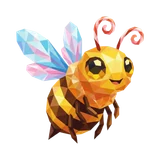
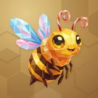

# 🔗 Zhe

## Profile

- Repository: [nocoo/zhe](https://github.com/nocoo/zhe)
- Website: [https://zhe.to](https://zhe.to)
- Website evidence: GitHub repository homepage
- Category: tools
- Archived repository: No; [repository status evidence](../sources/repository-status-2026-09-06.json)
- English: Short links, clean URLs, and a little less friction when sharing things.
- Chinese: 把长网址变成简洁的短链接，让分享少一点麻烦。
- Profile section: Recent Projects
- Profile revision: `9a7ad63e1e96428f9dcd12214bcdbd470b3b51c6`
- Repository revision inspected: `075c875936e9a244c147ff9d58452398bb1ef3cf`

## Project goal

Keep personal links, Markdown ideas, and nested todos together, with short-link sharing and unified search.

集中整理个人链接、Markdown 想法和层级待办，通过短链接分享并统一搜索内容。

- [中文 README](https://github.com/nocoo/zhe/blob/main/README.md) · [English README](https://github.com/nocoo/zhe/blob/main/docs/README.en.md)
- Verified: 2026-09-08; [source revision](https://github.com/nocoo/zhe/tree/967f6e738440ab0739697659c242652408d7155c)
- Source files: [`package.json`](https://github.com/nocoo/zhe/blob/967f6e738440ab0739697659c242652408d7155c/package.json), [`worker/src/index.ts`](https://github.com/nocoo/zhe/blob/967f6e738440ab0739697659c242652408d7155c/worker/src/index.ts), [`worker/wrangler.toml.example`](https://github.com/nocoo/zhe/blob/967f6e738440ab0739697659c242652408d7155c/worker/wrangler.toml.example), [`lib/db/d1-client.ts`](https://github.com/nocoo/zhe/blob/967f6e738440ab0739697659c242652408d7155c/lib/db/d1-client.ts), [`lib/db/scoped/links.ts`](https://github.com/nocoo/zhe/blob/967f6e738440ab0739697659c242652408d7155c/lib/db/scoped/links.ts), [`actions/ideas.ts`](https://github.com/nocoo/zhe/blob/967f6e738440ab0739697659c242652408d7155c/actions/ideas.ts), [`actions/todos.ts`](https://github.com/nocoo/zhe/blob/967f6e738440ab0739697659c242652408d7155c/actions/todos.ts), [`components/search-command-dialog.tsx`](https://github.com/nocoo/zhe/blob/967f6e738440ab0739697659c242652408d7155c/components/search-command-dialog.tsx), [`app/api/ai/suggest-link-org/route.ts`](https://github.com/nocoo/zhe/blob/967f6e738440ab0739697659c242652408d7155c/app/api/ai/suggest-link-org/route.ts), [`cli/src/index.ts`](https://github.com/nocoo/zhe/blob/967f6e738440ab0739697659c242652408d7155c/cli/src/index.ts), [`cli/src/api/client.ts`](https://github.com/nocoo/zhe/blob/967f6e738440ab0739697659c242652408d7155c/cli/src/api/client.ts), [`auth.ts`](https://github.com/nocoo/zhe/blob/967f6e738440ab0739697659c242652408d7155c/auth.ts), [`lib/auth-allowlist.ts`](https://github.com/nocoo/zhe/blob/967f6e738440ab0739697659c242652408d7155c/lib/auth-allowlist.ts), [`scripts/test-stack.ts`](https://github.com/nocoo/zhe/blob/967f6e738440ab0739697659c242652408d7155c/scripts/test-stack.ts)

### Tech stack

| Technology | Role | 用途 |
| --- | --- | --- |
| TypeScript | Application and CLI logic | 应用与 CLI 逻辑 |
| Next.js | Web dashboard and APIs | Web 管理台与 API |
| React | Interactive views | 交互视图 |
| Cloudflare Workers | Redirects and D1 proxy | 短链接跳转与 D1 代理 |
| Cloudflare D1 | User data | 用户数据 |
| Cloudflare KV | Redirect cache | 跳转缓存 |
| Cloudflare R2 | Uploaded files | 上传文件 |
| Auth.js | Google sign-in | Google 登录 |
| Bun | Dependency management and development tools | 依赖管理与开发工具 |
| Node.js | CLI runtime | CLI 运行环境 |
| Vercel AI SDK | Optional link organization suggestions | 可选的链接整理建议 |

## Current logo

- Type: Original project artwork, copied without modification
- Subject: Bee with colorful wings
- [Source](https://github.com/nocoo/zhe/blob/075c875936e9a244c147ff9d58452398bb1ef3cf/logo.png): `logo.png`
- [Preserved asset](../../public/logos/originals/zhe.png)
- Original dimensions: 2048 × 2048
- Original size: 3100798 bytes
- SHA-256: `a0c8b924026189661b2e5eb11d876775f5a3fd506c91b32e61992f53a811a046`
- Locally modified source: No
- Display derivatives: 32, 64, 160, and 1024 px WebP; contain-fit, transparent padding, no recoloring or cropping.

## Current palette

| Role | Value | Evidence |
| --- | --- | --- |
| primary | `#7c3bed` | app/globals.css --primary: 262 83% 58% |
| background | `#eeeff2` | app/globals.css --background: 220 14% 94% |
| accent | `#e48f2b` | Preserved project artwork, sampled pixel |
| accent | `#48260d` | Preserved project artwork, sampled pixel |
| accent | `#fac7e2` | Preserved project artwork, sampled pixel |

Theme tokens take precedence. Additional colors are sampled from the preserved artwork. A transparent background means the source does not define an opaque background; the gallery's surrounding paper is not part of the project palette.

## Refined identity

- Status: Adopted in the source project; updated 2026-09-07.
- Study `2026-09-07-01`, finishing `01`
- Refined subject: Original golden faceted bee with multicolored wings
- Site path: `/logos/zhe`; [local gallery](https://index.dev.hexly.ai/logos/zhe)
- [Static review HTML](../../artwork/logo-family/zhe/2026-09-07-01/review.html)
- [Full process archive](https://github.com/nocoo/hexly.ai/tree/main/artwork/logo-family/zhe/2026-09-07-01)
- [Transparent foreground](../../public/logos/family/zhe/2026-09-07-01/01/transparent.png); SHA-256: `a0c8b924026189661b2e5eb11d876775f5a3fd506c91b32e61992f53a811a046`
- [Square icon](../../public/logos/family/zhe/2026-09-07-01/01/icon.png), [rounded icon](../../public/logos/family/zhe/2026-09-07-01/01/rounded.png), [white version](../../public/logos/family/zhe/2026-09-07-01/01/white.png)
- [Untouched original](../../public/logos/family/zhe/2026-09-07-01/01/source.png), [presentation brief](../../public/logos/family/zhe/2026-09-07-01/01/brief.txt), [public asset checksums](../../public/logos/family/zhe/2026-09-07-01/01/manifest.json)
- [Previous original](../../public/logos/originals/zhe.png), copied from [its immutable source](https://github.com/nocoo/zhe/blob/120a01207c1b978a081413e785099d3580890d80/logo.png)
- Previous SHA-256: `a0c8b924026189661b2e5eb11d876775f5a3fd506c91b32e61992f53a811a046`
- Original artwork retained byte-for-byte at native 2048 × 2048. Zero image-generation calls; only background, grain, and shadow layers were composed.
- The finishing archive includes transparent, square, and rounded PNGs at 2048, 1024, 512, 256, 128, 64, 48, 32, 24, and 16 px.
- Application previews use the refined square icon without extra padding, backgrounds, or circular masks. Artwork previews and downloads use its own transparent foreground, independently of the preserved source logo above.

### Refined palette

| Role | Value | Evidence |
| --- | --- | --- |
| background | `#bb914f` | Selected Zhe presentation, finishing 01; background.base in archived settings.json |
| primary | `#f0b724` | Original zhe a0c8b9240261, sampled sRGB pixel (1478, 1111); palette.json |
| accent | `#e48f2a` | Original zhe a0c8b9240261, sampled sRGB pixel (1150, 1048); palette.json |
| accent | `#47260c` | Original zhe a0c8b9240261, sampled sRGB pixel (1159, 747); palette.json |
| accent | `#86cddf` | Original zhe a0c8b9240261, sampled sRGB pixel (616, 797); palette.json |
| accent | `#fac7e2` | Original zhe a0c8b9240261, sampled sRGB pixel (860, 398); palette.json |
| accent | `#e57863` | Original zhe a0c8b9240261, sampled sRGB pixel (1224, 300); palette.json |

### Keep the hovering gesture

The bee, antenna curls, wing spread, and original off-center balance remain unchanged. The native 2048 px canvas already gives the complete mark ample rounded-corner clearance.

蜜蜂、卷曲触角、展开的翅膀和原来的偏心平衡全部保留。2048 像素原图已经为完整主体留出了充分的圆角安全空间。

### Gold with one wing flourish

Broad honey and amber facets lead the body; the existing cyan-and-rose wing group supplies the colorful interest point. All source pixels and the transparent silhouette remain untouched.

蜂蜜金与琥珀色面构成主体，现有青粉色翅膀形成集中多彩的兴趣点。源图像素和透明轮廓均未修改。

### Pressed beeswax

Sparse oversized honeycomb cells sit around a warm beeswax field. Their uneven rhythm, light edges, fine grain, and shallow contact shadow support the bee without turning the logo into a scene.

稀疏的大蜂巢格分布在暖蜂蜡底色周围，不均匀的节奏、细亮边、颗粒和浅接触阴影衬托蜜蜂，保持标识的简洁。

Small-size observation: The golden body and cyan-pink wing group remain distinct at 32 px. At 16 px the antenna curls and smaller facets simplify into the overall silhouette; sidebar and browser marks use the transparent foreground.

## Further refinements

Keep this asset as the phase-one baseline. A future family version should use a recognizable animal, one principal hue, and restrained multicolored geometric fragments.

Use head portraits for large animals and optionally full-body poses for small animals. Compare artwork, app icon, sidebar, and favicon sizes in both themes before adopting a replacement. Preserve this reviewed composition and its archived predecessors.
