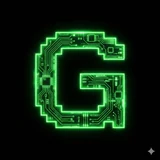
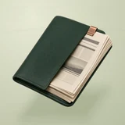

# 📰 GeekHub

## Profile

- Repository: [nocoo/geekhub](https://github.com/nocoo/geekhub)
- Website: [https://geekhub.vercel.app](https://geekhub.vercel.app)
- Website evidence: GitHub repository homepage
- Category: everyday
- Archived repository: No; [repository status evidence](../sources/repository-status-2026-09-06.json)
- English: A self-hosted RSS reader with AI summaries and translation.
- Chinese: 可以自行托管的 RSS 阅读器，带有 AI 摘要与翻译。
- Profile section: Recent Projects
- Profile revision: `9a7ad63e1e96428f9dcd12214bcdbd470b3b51c6`
- Repository revision inspected: `d45713b5d3a0cfd1530e31a7961e1b5748f1bb6c`

## Current logo

- Type: Original project artwork, copied without modification
- Subject: A folded newspaper in a forest-green reading folio
- [Source](https://github.com/nocoo/geekhub/blob/d45713b5d3a0cfd1530e31a7961e1b5748f1bb6c/logo.png): `logo.png`
- [Preserved asset](../../public/logos/originals/geekhub-family-2026-09-07-01-01.png)
- Original dimensions: 2048 × 2048
- Original size: 4053576 bytes
- SHA-256: `7de6b36e18165d87f1a840b9f762f2dce1739f70a28b8a50a9964c1a6fa4e545`
- Locally modified source: No
- Display derivatives: 32, 64, 160, and 1024 px WebP; contain-fit, transparent padding, no recoloring or cropping.

## Current palette

| Role | Value | Evidence |
| --- | --- | --- |
| primary | `#1cce7b` | src/app/globals.css --primary: 152 76% 46% |
| background | `#ffffff` | src/app/globals.css --background: 0 0% 100% |
| accent | `#1e3a2c` | Native geekhub 6535caedb328, sampled sRGB pixel (831, 332); artwork/logo-family/geekhub/2026-09-07-01/palette.json |
| accent | `#dacdb1` | Native geekhub 6535caedb328, sampled sRGB pixel (1613, 1224); artwork/logo-family/geekhub/2026-09-07-01/palette.json |
| accent | `#b37d58` | Native geekhub 6535caedb328, sampled sRGB pixel (1668, 374); artwork/logo-family/geekhub/2026-09-07-01/palette.json |

Theme tokens take precedence. Additional colors are sampled from the preserved artwork. A transparent background means the source does not define an opaque background; the gallery's surrounding paper is not part of the project palette.

## Refined identity

- Status: Adopted in the source project; updated 2026-09-07.
- Study `2026-09-07-01`, finishing `01`
- Refined subject: A folded newspaper in a forest-green reading folio
- Site path: `/logos/geekhub`; [local gallery](https://index.dev.hexly.ai/logos/geekhub)
- [Static review HTML](../../artwork/logo-family/geekhub/2026-09-07-01/review.html)
- [Full process archive](https://github.com/nocoo/hexly.ai/tree/main/artwork/logo-family/geekhub/2026-09-07-01)
- [Transparent foreground](../../public/logos/family/geekhub/2026-09-07-01/01/transparent.png); SHA-256: `7de6b36e18165d87f1a840b9f762f2dce1739f70a28b8a50a9964c1a6fa4e545`
- [Square icon](../../public/logos/family/geekhub/2026-09-07-01/01/icon.png), [rounded icon](../../public/logos/family/geekhub/2026-09-07-01/01/rounded.png), [white version](../../public/logos/family/geekhub/2026-09-07-01/01/white.png)
- [Untouched generation](../../public/logos/family/geekhub/2026-09-07-01/01/raw.png), [exact prompt](../../public/logos/family/geekhub/2026-09-07-01/01/prompt.txt), [public asset checksums](../../public/logos/family/geekhub/2026-09-07-01/01/manifest.json)
- [Previous original](../../public/logos/originals/geekhub.png), copied from [its immutable source](https://github.com/nocoo/geekhub/blob/4d3d7fa0676a0adda9e1af3f7f99b2cfd5855863/logo.png)
- Previous SHA-256: `a1cec3b549d3c812f52f7d47748584bf07cbfd636d4d15b8a6415cba9cb4f47b`
- Generation: gpt-image-2, native 2048 × 2048; transparent extraction and presentation are separate finishing steps.
- The finishing archive includes transparent, square, and rounded PNGs at 2048, 1024, 512, 256, 128, 64, 48, 32, 24, and 16 px.
- Application previews use the refined square icon without extra padding, backgrounds, or circular masks. Artwork previews and downloads use its own transparent foreground, independently of the preserved source logo above.

### Refined palette

| Role | Value | Evidence |
| --- | --- | --- |
| background | `#d0d3bb` | Adopted GeekHub presentation, 2026-09-07-01/01; background.base in archived settings.json |
| primary | `#1e3a2c` | Native geekhub 6535caedb328, sampled sRGB pixel (831, 332); artwork/logo-family/geekhub/2026-09-07-01/palette.json |
| accent | `#dacdb1` | Native geekhub 6535caedb328, sampled sRGB pixel (1613, 1224); artwork/logo-family/geekhub/2026-09-07-01/palette.json |
| accent | `#b37d58` | Native geekhub 6535caedb328, sampled sRGB pixel (1668, 374); artwork/logo-family/geekhub/2026-09-07-01/palette.json |

### A page ready to open

A forest-green folio holds a folded newspaper and one copper clip. The complete page corners and quiet layered silhouette make an RSS reading object, without a busy desk scene.

森林绿阅读夹收纳折叠报纸与一枚铜夹，完整纸角和安静层次表现 RSS 阅读，无需繁杂桌面场景。

### Leather, paper and copper

Fine leather grain and dense ivory paper create tactile contrast. Abstract headline and column rules suggest articles without generating illegible text.

精细皮纹与厚实象牙色纸张形成触感对比；抽象标题线与分栏暗示文章，不使用乱码文字。

### Collected columns

Staggered editorial columns, fine baseline rules and an offset paper-fold seam in warm olive paper. The field, grain and contact shadow are independent of transparent app marks.

暖橄榄纸面上的错位报栏、细基线和偏移折页线。 底色、颗粒与接触阴影均独立于透明应用标记。

Small-size observation: At 128/64 px, the green folio and layered ivory pages remain clear. At 32/24/16 px, the compact silhouette and dominant colors carry recognition; fine material detail, printed marks and background lines naturally merge.

## Further refinements

This is an owner-directed physical material or architectural identity. Preserve its physical materials, complete silhouette, selected camera and distinct tonal presentation. The animal-series drawing and accessory rules do not apply.

Keep the complete object uniformly inset from the actual rounded outline, with backgrounds, projected shadows and any external emission separate from the transparent foreground. Compare artwork, app icon, sidebar, and favicon sizes in both themes before adopting a replacement. Preserve this reviewed composition and its archived predecessors.
