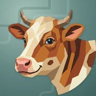

# 💰 Noheir

## Profile

- Repository: [nocoo/noheir](https://github.com/nocoo/noheir)
- Website: [https://noheir.hexly.ai](https://noheir.hexly.ai)
- Website evidence: GitHub repository homepage
- Category: everyday
- Archived repository: No; [repository status evidence](../sources/repository-status-2026-09-06.json)
- English: A clear view of your money: income, spending, assets, and the bigger picture.
- Chinese: 从收入、支出到资产，用一个清晰的视角理解自己的财务。
- Profile section: Recent Projects
- Profile revision: `9a7ad63e1e96428f9dcd12214bcdbd470b3b51c6`
- Repository revision inspected: `1041610cf06562bb04911e39f4356690f6256f57`

## Current logo

- Type: Original project artwork, copied without modification
- Subject: Cow portrait
- [Source](https://github.com/nocoo/noheir/blob/1041610cf06562bb04911e39f4356690f6256f57/logo.png): `logo.png`
- [Preserved asset](../../public/logos/originals/noheir.png)
- Original dimensions: 2048 × 2048
- Original size: 4210139 bytes
- SHA-256: `2ed854204cbc8801a253c10797de0ae73f45dc0b83508bd8cf4e1066eb9595bb`
- Locally modified source: No
- Display derivatives: 32, 64, 160, and 1024 px WebP; contain-fit, transparent padding, no recoloring or cropping.

## Current palette

| Role | Value | Evidence |
| --- | --- | --- |
| primary | `#25aff4` | src/app/globals.css --primary: 200 90% 55% |
| background | `#eeeff2` | src/app/globals.css --background: 220 14% 94% |
| accent | `#b4642f` | Preserved project artwork, sampled pixel |
| accent | `#d7b68b` | Preserved project artwork, sampled pixel |
| accent | `#efdfc1` | Preserved project artwork, sampled pixel |

Theme tokens take precedence. Additional colors are sampled from the preserved artwork. A transparent background means the source does not define an opaque background; the gallery's surrounding paper is not part of the project palette.

## Refined identity

- Status: Adopted in the source project; updated 2026-09-07.
- Study `2026-09-07-01`, finishing `01`
- Refined subject: Original warm brown and cream faceted cow portrait
- Site path: `/logos/noheir`; [local gallery](https://index.dev.hexly.ai/logos/noheir)
- [Static review HTML](../../artwork/logo-family/noheir/2026-09-07-01/review.html)
- [Full process archive](https://github.com/nocoo/hexly.ai/tree/main/artwork/logo-family/noheir/2026-09-07-01)
- [Transparent foreground](../../public/logos/family/noheir/2026-09-07-01/01/transparent.png); SHA-256: `2ed854204cbc8801a253c10797de0ae73f45dc0b83508bd8cf4e1066eb9595bb`
- [Square icon](../../public/logos/family/noheir/2026-09-07-01/01/icon.png), [rounded icon](../../public/logos/family/noheir/2026-09-07-01/01/rounded.png), [white version](../../public/logos/family/noheir/2026-09-07-01/01/white.png)
- [Untouched original](../../public/logos/family/noheir/2026-09-07-01/01/source.png), [presentation brief](../../public/logos/family/noheir/2026-09-07-01/01/brief.txt), [public asset checksums](../../public/logos/family/noheir/2026-09-07-01/01/manifest.json)
- [Previous original](../../public/logos/originals/noheir.png), copied from [its immutable source](https://github.com/nocoo/noheir/blob/2c99001444856d7756589254a52696af2cdfbab9/logo.png)
- Previous SHA-256: `2ed854204cbc8801a253c10797de0ae73f45dc0b83508bd8cf4e1066eb9595bb`
- Original artwork retained byte-for-byte at native 2048 × 2048. Zero image-generation calls; only background, grain, and shadow layers were composed.
- The finishing archive includes transparent, square, and rounded PNGs at 2048, 1024, 512, 256, 128, 64, 48, 32, 24, and 16 px.
- Application previews use the refined square icon without extra padding, backgrounds, or circular masks. Artwork previews and downloads use its own transparent foreground, independently of the preserved source logo above.

### Refined palette

| Role | Value | Evidence |
| --- | --- | --- |
| background | `#638783` | Selected Noheir presentation, finishing 01; background.base in archived settings.json |
| primary | `#b4642f` | Original noheir 2ed854204cbc, sampled sRGB pixel (1219, 426); palette.json |
| accent | `#f0dfc1` | Original noheir 2ed854204cbc, sampled sRGB pixel (902, 421); palette.json |
| accent | `#d7b68b` | Original noheir 2ed854204cbc, sampled sRGB pixel (1069, 360); palette.json |
| accent | `#ee9d8a` | Original noheir 2ed854204cbc, sampled sRGB pixel (530, 1341); palette.json |
| accent | `#566b7e` | Original noheir 2ed854204cbc, sampled sRGB pixel (537, 855); palette.json |

### Keep the gentle three-quarter view

The cow, horns, ears, expression, and original shoulder silhouette remain exactly as supplied. The warm animal stays prominent without changing its proportions.

奶牛、角、耳朵、表情和原来的肩部轮廓均原样保留，在不改变比例的情况下突出暖色主体。

### Warm patches, clear eyes

The existing copper, cream, coral nose, and blue eye facets are retained. This presentation-only pass adds no accessory, repaint, or model generation.

原有铜棕、奶油色、珊瑚鼻尖与蓝色眼睛碎片均保留。这次只完善展示，不加配饰、不重涂，也不调用生图。

### A cool terraced field

Unequal stepped contours sit on a muted green field. Their broad rhythm and tiny lit edges contrast the warm cow while keeping the finance app UI palette separate.

高低不一的阶梯轮廓落在柔和绿色底面上，宽阔节奏与细亮边衬托暖色奶牛；财务应用的界面色板单独保留。

Small-size observation: The cream blaze, horns, and coral nose anchor the 32 px silhouette. At 16 px smaller patches merge; browser and sidebar marks use the transparent source while installed-app icons use the presentation.

## Further refinements

Keep this asset as the phase-one baseline. A future family version should use a recognizable animal, one principal hue, and restrained multicolored geometric fragments.

Use head portraits for large animals and optionally full-body poses for small animals. Compare artwork, app icon, sidebar, and favicon sizes in both themes before adopting a replacement. Preserve this reviewed composition and its archived predecessors.
