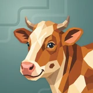

# 💰 Noheir

## Profile

- Repository: [nocoo/noheir](https://github.com/nocoo/noheir)
- Website: [https://noheir.hexly.ai](https://noheir.hexly.ai)
- Website evidence: GitHub repository homepage
- Category: everyday
- Archived repository: No; [repository status evidence](../sources/repository-status-2026-09-06.json)
- English: A clear view of your money: income, spending, assets, and the bigger picture.
- Chinese: 从收入、支出到资产，用一个清晰的视角理解自己的财务。
- Profile section: Recent Projects
- Profile revision: `9a7ad63e1e96428f9dcd12214bcdbd470b3b51c6`
- Repository revision inspected: `5e32426a6044436eee5c6b2894910666896a8b49`

## Project goal

Organize personal transactions, accounts and capital to review cash flow, allocation, returns and availability dates.

整理个人收支、账户和存量资金，查看现金流、资金配置、收益与可用日期。

- [中文 README](https://github.com/nocoo/noheir/blob/main/README.md) · [English README](https://github.com/nocoo/noheir/blob/main/docs/README.en.md)
- Verified: 2026-09-08; [source revision](https://github.com/nocoo/noheir/tree/68d20b352d8873865f39d2da89e2d086fcb5e03d)
- Source files: [`package.json`](https://github.com/nocoo/noheir/blob/68d20b352d8873865f39d2da89e2d086fcb5e03d/package.json), [`worker/package.json`](https://github.com/nocoo/noheir/blob/68d20b352d8873865f39d2da89e2d086fcb5e03d/worker/package.json), [`worker/wrangler.toml`](https://github.com/nocoo/noheir/blob/68d20b352d8873865f39d2da89e2d086fcb5e03d/worker/wrangler.toml), [`worker/src/index.ts`](https://github.com/nocoo/noheir/blob/68d20b352d8873865f39d2da89e2d086fcb5e03d/worker/src/index.ts), [`worker/db/schema.ts`](https://github.com/nocoo/noheir/blob/68d20b352d8873865f39d2da89e2d086fcb5e03d/worker/db/schema.ts), [`src/auth.ts`](https://github.com/nocoo/noheir/blob/68d20b352d8873865f39d2da89e2d086fcb5e03d/src/auth.ts), [`src/lib/navigation.ts`](https://github.com/nocoo/noheir/blob/68d20b352d8873865f39d2da89e2d086fcb5e03d/src/lib/navigation.ts), [`src/app/actions/import-actions.ts`](https://github.com/nocoo/noheir/blob/68d20b352d8873865f39d2da89e2d086fcb5e03d/src/app/actions/import-actions.ts), [`src/app/actions/data-actions.ts`](https://github.com/nocoo/noheir/blob/68d20b352d8873865f39d2da89e2d086fcb5e03d/src/app/actions/data-actions.ts), [`src/app/ai-insight/page.tsx`](https://github.com/nocoo/noheir/blob/68d20b352d8873865f39d2da89e2d086fcb5e03d/src/app/ai-insight/page.tsx), [`src/app/api/mcp/route.ts`](https://github.com/nocoo/noheir/blob/68d20b352d8873865f39d2da89e2d086fcb5e03d/src/app/api/mcp/route.ts), [`src/lib/mcp/server.ts`](https://github.com/nocoo/noheir/blob/68d20b352d8873865f39d2da89e2d086fcb5e03d/src/lib/mcp/server.ts), [`scripts/run-e2e.ts`](https://github.com/nocoo/noheir/blob/68d20b352d8873865f39d2da89e2d086fcb5e03d/scripts/run-e2e.ts), [`e2e/bdd/navigation.spec.ts`](https://github.com/nocoo/noheir/blob/68d20b352d8873865f39d2da89e2d086fcb5e03d/e2e/bdd/navigation.spec.ts), [`.github/workflows/release.yml`](https://github.com/nocoo/noheir/blob/68d20b352d8873865f39d2da89e2d086fcb5e03d/.github/workflows/release.yml), [`Dockerfile`](https://github.com/nocoo/noheir/blob/68d20b352d8873865f39d2da89e2d086fcb5e03d/Dockerfile)

### Tech stack

| Technology | Role | 用途 |
| --- | --- | --- |
| TypeScript | Application and financial calculations | 应用与财务计算 |
| Next.js | Web pages, Server Actions and MCP endpoints | Web 页面、Server Actions 与 MCP 入口 |
| React | Interactive finance views | 财务交互界面 |
| Cloudflare Workers | Business API and SQL access | 业务 API 与 SQL 访问 |
| Cloudflare D1 | Financial records and user settings | 财务记录与用户设置存储 |
| Drizzle ORM | Database schema and repositories | 数据模型与查询 |
| Auth.js | Google sign-in and sessions | Google 登录与会话 |
| MCP SDK | Authorized finance tools for clients | 供客户端授权访问的财务工具 |
| Bun | Development, HTTP tests and Docker runtime | 开发、HTTP 测试与 Docker 运行时 |

## Current logo

- Type: Original project artwork, copied without modification
- Subject: Cow portrait
- [Source](https://github.com/nocoo/noheir/blob/5e32426a6044436eee5c6b2894910666896a8b49/logo.png): `logo.png`
- [Preserved asset](../../public/logos/originals/noheir-family-2026-09-07-02-02.png)
- Original dimensions: 2048 × 2048
- Original size: 3801133 bytes
- SHA-256: `26d9720f81d6233909a9cffd5a791c62d7d3b46cb37da4875009d7ca875eaeff`
- Locally modified source: No
- Display derivatives: 32, 64, 160, and 1024 px WebP; contain-fit, transparent padding, no recoloring or cropping.

## Current palette

| Role | Value | Evidence |
| --- | --- | --- |
| primary | `#25aff4` | src/app/globals.css --primary: 200 90% 55% |
| background | `#eeeff2` | src/app/globals.css --background: 220 14% 94% |
| accent | `#b4642e` | Native noheir 61f13d785b85, sampled sRGB pixel (1032, 870); artwork/logo-family/noheir/2026-09-07-02/palette.json |
| accent | `#f1ddc3` | Native noheir 61f13d785b85, sampled sRGB pixel (683, 558); artwork/logo-family/noheir/2026-09-07-02/palette.json |
| accent | `#f29b8a` | Native noheir 61f13d785b85, sampled sRGB pixel (631, 1385); artwork/logo-family/noheir/2026-09-07-02/palette.json |

Theme tokens take precedence. Additional colors are sampled from the preserved artwork. A transparent background means the source does not define an opaque background; the gallery's surrounding paper is not part of the project palette.

## Refined identity

- Status: Adopted in the source project; updated 2026-09-07.
- Study `2026-09-07-02`, finishing `02`
- Refined subject: Copper and cream cow with complete horns, blue eyes, and a coral muzzle
- Site path: `/logos/noheir`; [local gallery](https://index.dev.hexly.ai/logos/noheir)
- [Static review HTML](../../artwork/logo-family/noheir/2026-09-07-02/review.html)
- [Full process archive](https://github.com/nocoo/hexly.ai/tree/main/artwork/logo-family/noheir/2026-09-07-02)
- [Transparent foreground](../../public/logos/family/noheir/2026-09-07-02/02/transparent.png); SHA-256: `26d9720f81d6233909a9cffd5a791c62d7d3b46cb37da4875009d7ca875eaeff`
- [Square icon](../../public/logos/family/noheir/2026-09-07-02/02/icon.png), [rounded icon](../../public/logos/family/noheir/2026-09-07-02/02/rounded.png), [white version](../../public/logos/family/noheir/2026-09-07-02/02/white.png)
- [Untouched generation](../../public/logos/family/noheir/2026-09-07-02/02/raw.png), [exact prompt](../../public/logos/family/noheir/2026-09-07-02/02/prompt.txt), [public asset checksums](../../public/logos/family/noheir/2026-09-07-02/02/manifest.json)
- [Previous original](../../public/logos/originals/noheir.png), copied from [its immutable source](https://github.com/nocoo/noheir/blob/1041610cf06562bb04911e39f4356690f6256f57/logo.png)
- Previous SHA-256: `2ed854204cbc8801a253c10797de0ae73f45dc0b83508bd8cf4e1066eb9595bb`
- Generation: gpt-image-2, native 2048 × 2048; transparent extraction and presentation are separate finishing steps.
- The finishing archive includes transparent, square, and rounded PNGs at 2048, 1024, 512, 256, 128, 64, 48, 32, 24, and 16 px.
- Application previews use the refined square icon without extra padding, backgrounds, or circular masks. Artwork previews and downloads use its own transparent foreground, independently of the preserved source logo above.

### Refined palette

| Role | Value | Evidence |
| --- | --- | --- |
| background | `#638783` | Selected Noheir presentation, 2026-09-07-02/02; background.base in archived settings.json |
| primary | `#b4642e` | Native noheir 61f13d785b85, sampled sRGB pixel (1032, 870); artwork/logo-family/noheir/2026-09-07-02/palette.json |
| accent | `#f1ddc3` | Native noheir 61f13d785b85, sampled sRGB pixel (683, 558); artwork/logo-family/noheir/2026-09-07-02/palette.json |
| accent | `#f29b8a` | Native noheir 61f13d785b85, sampled sRGB pixel (631, 1385); artwork/logo-family/noheir/2026-09-07-02/palette.json |
| accent | `#586b7b` | Native noheir 61f13d785b85, sampled sRGB pixel (1128, 869); artwork/logo-family/noheir/2026-09-07-02/palette.json |
| accent | `#713b28` | Native noheir 61f13d785b85, sampled sRGB pixel (1616, 1501); artwork/logo-family/noheir/2026-09-07-02/palette.json |

### A gentle three-quarter turn

The familiar face keeps both horns and ears clear. A short neck settles into a broad shoulder entering the lower-right frame, replacing the old internal bust cut.

熟悉的面孔保留完整牛角与耳朵，短颈自然连接宽厚肩部并从右下进入画框，替换原先画面内部的头像截断。

### Warm patches and clear eyes

Broad copper and cream facets preserve the cow’s expression, coral nose, and blue eyes. This framing repair retains the existing accents without adding accessories.

大块铜棕和奶油色面保留奶牛表情、珊瑚鼻尖和蓝眼睛；这次修复构图，沿用原有点缀而不增加配饰。

### Quiet terraces

The retained muted green field uses unequal stepped contours and softly lit edges. Its cool color contrasts the warm animal while the finance app theme remains separate.

沿用柔和绿色底面、高低不一的阶梯轮廓与细亮边，以冷暖对比衬托奶牛；财务应用主题色单独保留。

Small-size observation: The cream blaze, paired horns, and coral muzzle stay legible at 32 px. Smaller color planes merge at 16 px; transparent marks serve the sidebar and browser, while installed icons use the square presentation.

## Further refinements

Keep this asset as the phase-one baseline. A future family version should use a recognizable animal, one principal hue, and restrained multicolored geometric fragments.

Use head portraits for large animals and optionally full-body poses for small animals. Compare artwork, app icon, sidebar, and favicon sizes in both themes before adopting a replacement. Preserve this reviewed composition and its archived predecessors.
