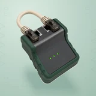

# 🛡️ IPSafe

## Profile

- Repository: [nocoo/ipsafe](https://github.com/nocoo/ipsafe)
- Website: No current website verified; navigation opens the repository.
- Website evidence: Not applicable
- Category: tools
- Archived repository: No; [repository status evidence](../sources/repository-status-2026-09-06.json)
- English: Check your network connection before letting a command run.
- Chinese: 在执行命令之前，先确认网络连接符合预期。
- Profile section: CLI Tools
- Profile revision: `9a7ad63e1e96428f9dcd12214bcdbd470b3b51c6`
- Repository revision inspected: `d8a28afb9ed85d4f3d1627738415a863f82b3629`

## Current logo

- Type: Original project artwork, copied without modification
- Subject: A green network cable tester with a short patch lead
- [Source](https://github.com/nocoo/ipsafe/blob/d8a28afb9ed85d4f3d1627738415a863f82b3629/logo.png): `logo.png`
- [Preserved asset](../../public/logos/originals/ipsafe-family-2026-09-07-01-01.png)
- Original dimensions: 2048 × 2048
- Original size: 3104822 bytes
- SHA-256: `1cad3a55e3b03e27cc3962351e72026af873120e5dcd0bfb8afe9b5fe65bc75b`
- Locally modified source: No
- Display derivatives: 32, 64, 160, and 1024 px WebP; contain-fit, transparent padding, no recoloring or cropping.

## Current palette

| Role | Value | Evidence |
| --- | --- | --- |
| primary | `#315040` | Native ipsafe 949f4e0683ee, sampled sRGB pixel (1523, 1416); artwork/logo-family/ipsafe/2026-09-07-01/palette.json |
| background | `#bbd2c7` | Adopted IPSafe presentation, 2026-09-07-01/01; background.base in archived settings.json |
| accent | `#424646` | Native ipsafe 949f4e0683ee, sampled sRGB pixel (1474, 839); artwork/logo-family/ipsafe/2026-09-07-01/palette.json |
| accent | `#dcd1ba` | Native ipsafe 949f4e0683ee, sampled sRGB pixel (926, 316); artwork/logo-family/ipsafe/2026-09-07-01/palette.json |
| accent | `#64de0f` | Native ipsafe 949f4e0683ee, sampled sRGB pixel (1322, 1184); artwork/logo-family/ipsafe/2026-09-07-01/palette.json |

Theme tokens take precedence. Additional colors are sampled from the preserved artwork. A transparent background means the source does not define an opaque background; the gallery's surrounding paper is not part of the project palette.

## Refined identity

- Status: Adopted in the source project; updated 2026-09-07.
- Study `2026-09-07-01`, finishing `01`
- Refined subject: A green network cable tester with a short patch lead
- Site path: `/logos/ipsafe`; [local gallery](https://index.dev.hexly.ai/logos/ipsafe)
- [Static review HTML](../../artwork/logo-family/ipsafe/2026-09-07-01/review.html)
- [Full process archive](https://github.com/nocoo/hexly.ai/tree/main/artwork/logo-family/ipsafe/2026-09-07-01)
- [Transparent foreground](../../public/logos/family/ipsafe/2026-09-07-01/01/transparent.png); SHA-256: `1cad3a55e3b03e27cc3962351e72026af873120e5dcd0bfb8afe9b5fe65bc75b`
- [Square icon](../../public/logos/family/ipsafe/2026-09-07-01/01/icon.png), [rounded icon](../../public/logos/family/ipsafe/2026-09-07-01/01/rounded.png), [white version](../../public/logos/family/ipsafe/2026-09-07-01/01/white.png)
- [Untouched generation](../../public/logos/family/ipsafe/2026-09-07-01/01/raw.png), [exact prompt](../../public/logos/family/ipsafe/2026-09-07-01/01/prompt.txt), [public asset checksums](../../public/logos/family/ipsafe/2026-09-07-01/01/manifest.json)
- [Previous original](../../public/logos/emoji/ipsafe.png), copied from [its immutable source](https://github.com/nocoo/nocoo/blob/9a7ad63e1e96428f9dcd12214bcdbd470b3b51c6/README.md)
- Previous SHA-256: `cfb96dff0fac916f28c150e67adb746fb6b5c6adbe54286f66e23095bb5c239d`
- Generation: gpt-image-2, native 2048 × 2048; transparent extraction and presentation are separate finishing steps.
- The finishing archive includes transparent, square, and rounded PNGs at 2048, 1024, 512, 256, 128, 64, 48, 32, 24, and 16 px.
- Application previews use the refined square icon without extra padding, backgrounds, or circular masks. Artwork previews and downloads use its own transparent foreground, independently of the preserved source logo above.

### Refined palette

| Role | Value | Evidence |
| --- | --- | --- |
| background | `#bbd2c7` | Adopted IPSafe presentation, 2026-09-07-01/01; background.base in archived settings.json |
| primary | `#315040` | Native ipsafe 949f4e0683ee, sampled sRGB pixel (1523, 1416); artwork/logo-family/ipsafe/2026-09-07-01/palette.json |
| accent | `#424646` | Native ipsafe 949f4e0683ee, sampled sRGB pixel (1474, 839); artwork/logo-family/ipsafe/2026-09-07-01/palette.json |
| accent | `#dcd1ba` | Native ipsafe 949f4e0683ee, sampled sRGB pixel (926, 316); artwork/logo-family/ipsafe/2026-09-07-01/palette.json |
| accent | `#64de0f` | Native ipsafe 949f4e0683ee, sampled sRGB pixel (1322, 1184); artwork/logo-family/ipsafe/2026-09-07-01/palette.json |

### The connection passes

A compact cable tester holds a short patch lead close to two ports. Three small status lights identify a completed connectivity check before the next command.

紧凑网线测试仪用短跳线连接两端口，三颗小状态灯表现下一条命令执行前已经通过的连接检查。

### Rubber, metal and cable

Green molded rubber surrounds a brushed charcoal face. Opaque cream cable and smoky connectors remain physical; the large loop opening is transparent.

绿色模压橡胶包覆拉丝深灰面板，象牙色线缆与烟灰接头保留实体质感，大线圈镂空透明。

### Connection lanes

Paired port rectangles, guarded chevron lanes and three short status bars in quiet mint paper. The field, grain and contact shadow are independent of transparent app marks.

薄荷色纸面上的成对端口、保护通道折线和三条状态短线。 底色、颗粒与接触阴影均独立于透明应用标记。

Small-size observation: At 128/64 px, the dark tester and cream cable loop remain clear. At 32/24/16 px, the compact silhouette and dominant colors carry recognition; fine material detail, printed marks and background lines naturally merge.

## Further refinements

This is an owner-directed physical material or architectural identity. Preserve its physical materials, complete silhouette, selected camera and distinct tonal presentation. The animal-series drawing and accessory rules do not apply.

Keep the complete object uniformly inset from the actual rounded outline, with backgrounds, projected shadows and any external emission separate from the transparent foreground. Compare artwork, app icon, sidebar, and favicon sizes in both themes before adopting a replacement. Preserve this reviewed composition and its archived predecessors.
