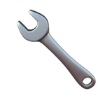

# 🔧 Discuz Recovery

## Profile

- Repository: [nocoo/discuz-recovery](https://github.com/nocoo/discuz-recovery)
- Website: No current website verified; navigation opens the repository.
- Website evidence: Not applicable
- Category: archive
- English: Bring old Discuz! forum posts back from their backups.
- Chinese: 从旧备份中找回 Discuz! 论坛的帖子。
- Profile section: Legacy Projects
- Profile revision: `9a7ad63e1e96428f9dcd12214bcdbd470b3b51c6`
- Repository revision inspected: `0287558e963d757952a3d58d95a4fa2bff5580d8`

## Current logo

- Type: Existing GitHub-profile emoji rendered as a portable PNG; no independent project logo was found
- Subject: Existing profile emoji
- [Source](https://github.com/nocoo/nocoo/blob/9a7ad63e1e96428f9dcd12214bcdbd470b3b51c6/README.md): `nocoo/nocoo README.md — existing project emoji`
- [Preserved asset](../../public/logos/emoji/discuz-recovery.png)
- Original dimensions: 1024 × 1024
- Original size: 252854 bytes
- SHA-256: `dbc4c45f02f94a25b39420c913494fd648794706b0e46981cf81a0aa2e259c51`
- Locally modified source: No
- Display derivatives: 32, 64, 160, and 1024 px WebP; contain-fit, transparent padding, no recoloring or cropping.

## Current palette

| Role | Value | Evidence |
| --- | --- | --- |
| primary | `#b2d3ee` | Existing profile emoji glyph, dominant colored pixels |
| background | `transparent` | Existing profile emoji glyph, transparent background |
| accent | `#97a4b4` | Existing profile emoji glyph, sampled pixel |
| accent | `#625a56` | Existing profile emoji glyph, sampled pixel |
| accent | `#303234` | Existing profile emoji glyph, sampled pixel |

Theme tokens take precedence. Additional colors are sampled from the preserved artwork. A transparent background means the source does not define an opaque background; the gallery's surrounding paper is not part of the project palette.

## Future family notes

Keep this asset as the phase-one baseline. A future family version should use a recognizable animal, one principal hue, and restrained multicolored geometric fragments.

Use head portraits for large animals and optionally full-body poses for small animals. Compare artwork, app icon, sidebar, and favicon sizes in both themes before adopting a replacement. No new logo is generated in phase one.
