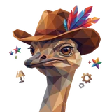
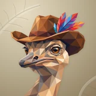

# ✂️ clip

## Profile

- Repository: [nocoo/clip](https://github.com/nocoo/clip)
- Website: No current website verified; navigation opens the repository.
- Website evidence: Not applicable
- Category: tools
- Archived repository: No; [repository status evidence](../sources/repository-status-2026-09-06.json)
- English: Generate fully working CLIs from a clip.yaml schema, with built-in credential management
- Chinese: 从 clip.yaml 生成可用的 CLI 工具，并集中管理 API 凭据与鉴权。
- Profile section: Recent Projects
- Profile revision: `880737d35ff74923cc0c96873fccf9e09ea5e569`
- Repository revision inspected: `d5dcc44d769d5f5ebc08d47537684a9d34cb6a6c`

## Project goal

Turn an HTTP API definition in clip.yaml into an editable command-line client, with credentials stored separately for each tool.

将 clip.yaml 中的 HTTP API 定义转换为可编辑的命令行客户端，并按工具分别管理凭据。

- [中文 README](https://github.com/nocoo/clip/blob/main/README.md) · [English README](https://github.com/nocoo/clip/blob/main/docs/README.en.md)
- Verified: 2026-09-08; [source revision](https://github.com/nocoo/clip/tree/071d10dd71f913814a47a68047265883642c851c)
- Source files: [`package.json`](https://github.com/nocoo/clip/blob/071d10dd71f913814a47a68047265883642c851c/package.json), [`packages/cli/package.json`](https://github.com/nocoo/clip/blob/071d10dd71f913814a47a68047265883642c851c/packages/cli/package.json), [`packages/cli/src/index.ts`](https://github.com/nocoo/clip/blob/071d10dd71f913814a47a68047265883642c851c/packages/cli/src/index.ts), [`packages/cli/src/schema/validator.ts`](https://github.com/nocoo/clip/blob/071d10dd71f913814a47a68047265883642c851c/packages/cli/src/schema/validator.ts), [`packages/cli/src/codegen/generator.ts`](https://github.com/nocoo/clip/blob/071d10dd71f913814a47a68047265883642c851c/packages/cli/src/codegen/generator.ts), [`packages/cli/src/codegen/templates.ts`](https://github.com/nocoo/clip/blob/071d10dd71f913814a47a68047265883642c851c/packages/cli/src/codegen/templates.ts), [`packages/cli/src/auth/storage.ts`](https://github.com/nocoo/clip/blob/071d10dd71f913814a47a68047265883642c851c/packages/cli/src/auth/storage.ts), [`packages/cli/src/commands/auth.ts`](https://github.com/nocoo/clip/blob/071d10dd71f913814a47a68047265883642c851c/packages/cli/src/commands/auth.ts), [`packages/cli/src/commands/install.ts`](https://github.com/nocoo/clip/blob/071d10dd71f913814a47a68047265883642c851c/packages/cli/src/commands/install.ts), [`packages/cli/src/commands/test.ts`](https://github.com/nocoo/clip/blob/071d10dd71f913814a47a68047265883642c851c/packages/cli/src/commands/test.ts), [`packages/web/package.json`](https://github.com/nocoo/clip/blob/071d10dd71f913814a47a68047265883642c851c/packages/web/package.json)

### Tech stack

| Technology | Role | 用途 |
| --- | --- | --- |
| Bun / TypeScript | CLI runtime and code generation | CLI 运行环境与代码生成 |
| commander | Generated commands and arguments | 生成的命令与参数解析 |
| Zod / yaml | Schema parsing and validation | Schema 解析与校验 |
| @nocoo/base-cli | Browser login and local callback | 浏览器登录与本机回调 |
| Hono | Example and test APIs | 示例与测试 API |
| Astro | Static documentation site | 静态文档站 |

## Current logo

- Type: Original project artwork, copied without modification
- Subject: Faceted brown ostrich in a feathered hat
- [Source](https://github.com/nocoo/clip/blob/d5dcc44d769d5f5ebc08d47537684a9d34cb6a6c/logo.png): `logo.png`
- [Preserved asset](../../public/logos/originals/clip.png)
- Original dimensions: 2048 × 2048
- Original size: 3160958 bytes
- SHA-256: `4892842297da37ebe701ad3c9d9713164b32879f1c8a93faf357e3feb5bd5009`
- Locally modified source: No
- Display derivatives: 32, 64, 160, and 1024 px WebP; contain-fit, transparent padding, no recoloring or cropping.

## Current palette

| Role | Value | Evidence |
| --- | --- | --- |
| primary | `#6366f1` | packages/web/src/styles/global.css :root --color-accent |
| background | `#0a0a0b` | packages/web/src/styles/global.css :root --color-bg |
| accent | `#e4e4e7` | packages/web/src/styles/global.css :root --color-text |

Theme tokens take precedence. Additional colors are sampled from the preserved artwork. A transparent background means the source does not define an opaque background; the gallery's surrounding paper is not part of the project palette.

## Refined identity

- Status: Local review; this finishing pass has not been adopted in the source project; updated 2026-09-07.
- Study `2026-09-07-02`, finishing `01`
- Refined subject: An amber-eyed ostrich in a brown hat with one bright feather cluster
- Site path: `/projects/clip#brand`; [local gallery](https://index.dev.hexly.ai/projects/clip#brand)
- [Static review HTML](../../artwork/logo-family/clip/2026-09-07-02/review.html)
- [Full process archive](https://github.com/nocoo/hexly.ai/tree/main/artwork/logo-family/clip/2026-09-07-02)
- [Transparent foreground](../../public/logos/family/clip/2026-09-07-02/01/transparent.png); SHA-256: `3399eb7f9ed54899845c6d686ad3c498c253b369e61b8acee4e41fd161158983`
- [Square icon](../../public/logos/family/clip/2026-09-07-02/01/icon.png), [rounded icon](../../public/logos/family/clip/2026-09-07-02/01/rounded.png), [white version](../../public/logos/family/clip/2026-09-07-02/01/white.png)
- [Untouched generation](../../public/logos/family/clip/2026-09-07-02/01/raw.png), [exact prompt](../../public/logos/family/clip/2026-09-07-02/01/prompt.txt), [public asset checksums](../../public/logos/family/clip/2026-09-07-02/01/manifest.json)
- [Previous original](../../public/logos/originals/clip.png), copied from [its immutable source](https://github.com/nocoo/clip/blob/d5dcc44d769d5f5ebc08d47537684a9d34cb6a6c/logo.png)
- Previous SHA-256: `4892842297da37ebe701ad3c9d9713164b32879f1c8a93faf357e3feb5bd5009`
- Generation: gpt-image-2, native 2048 × 2048; transparent extraction and presentation are separate finishing steps.
- The finishing archive includes transparent, square, and rounded PNGs at 2048, 1024, 512, 256, 128, 64, 48, 32, 24, and 16 px.
- Application previews use the refined square icon without extra padding, backgrounds, or circular masks. Artwork previews and downloads use its own transparent foreground, independently of the preserved source logo above.

### Refined palette

| Role | Value | Evidence |
| --- | --- | --- |
| background | `#baae91` | Selected local presentation, clip/2026-09-07-02/01; background.base in archived settings.json |
| primary | `#df9457` | Native clip a1268bdaffd6, sampled sRGB pixel (820, 310); artwork/logo-family/clip/2026-09-07-02/palette.json |
| accent | `#b3977a` | Native clip a1268bdaffd6, sampled sRGB pixel (1130, 1620); artwork/logo-family/clip/2026-09-07-02/palette.json |
| accent | `#542c1c` | Native clip a1268bdaffd6, sampled sRGB pixel (1110, 500); artwork/logo-family/clip/2026-09-07-02/palette.json |
| accent | `#67b8db` | Native clip a1268bdaffd6, sampled sRGB pixel (1470, 325); artwork/logo-family/clip/2026-09-07-02/palette.json |
| accent | `#ec3536` | Native clip a1268bdaffd6, sampled sRGB pixel (1330, 252); artwork/logo-family/clip/2026-09-07-02/palette.json |
| accent | `#aa438c` | Native clip a1268bdaffd6, sampled sRGB pixel (1650, 235); artwork/logo-family/clip/2026-09-07-02/palette.json |

### A glance under the brim

The original ostrich turns toward the left while its hat and feather spray balance the upper right. A close portrait keeps the face substantial; the natural neck continues through the bottom of the viewfinder. One uniform 90% placement gives the whole brim, beak and feather tips room inside the rounded tile.

沿用原来的鸵鸟，向左回眸，宽檐帽与羽毛在右上方平衡画面。近景保留饱满的面部，颈部自然延伸至取景框下沿；整体以 90% 等比放置，为帽檐、喙和羽尖留下圆角安全空间。

### Warm facets, one feather spray

Connected sandstone, tan and cocoa planes carry the face, neck and brown hat. Amber eyes retain the familiar expression. Coral, turquoise, blue and violet gather in one attached feather cluster; the old satellite ornaments give way to this single accent.

砂岩、浅棕与可可色的连贯色块构成面部、颈部和棕帽，琥珀眼保留熟悉的神态。珊瑚、青蓝和紫色集中在帽上的一簇羽毛，原图分散的小装饰收拢为这一处兴趣点。

### Windward feather relief

Warm linen paper carries long curved quills and spaced feather barbs through the empty corners. Soft light and shallow contact shadows give the presentation depth while the transparent bird remains free of background, grain and shadow.

暖亚麻纸面在留白处铺开弯曲的羽轴与疏朗羽纹，柔光和浅接触阴影增加层次。透明鸵鸟独立保存，不含底纹、背景或阴影。

Small-size observation: The brim, beak and colorful feather silhouette carry the 32/16 px mark; individual eye facets and feather divisions soften at favicon size. Small app and browser marks use the transparent portrait, including its intentional lower neck entry.

## Further refinements

Keep this asset as the phase-one baseline. A future family version should use a recognizable animal, one principal hue, and restrained multicolored geometric fragments.

Use head portraits for large animals and optionally full-body poses for small animals. Compare artwork, app icon, sidebar, and favicon sizes in both themes before adopting a replacement. Preserve this reviewed composition and its archived predecessors.
