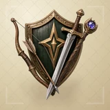

# 🌸 DreamRO

## Profile

- Repository: [nocoo/dreamro](https://github.com/nocoo/dreamro)
- Website: [https://dreamro.hexly.ai](https://dreamro.hexly.ai)
- Website evidence: GitHub repository homepage and README.md linked game preview
- Category: games
- Archived repository: No; [repository status evidence](../sources/repository-status-2026-09-06.json)
- English: Nostalgic 3D browser RPG with 20 classes, three realms, and local saves
- Chinese: 怀旧风格的 3D 网页角色扮演游戏，提供 20 种职业、三大区域和本地存档。
- Profile section: Games
- Profile revision: `880737d35ff74923cc0c96873fccf9e09ea5e569`
- Repository revision inspected: `07185e854a59e320f8b2a45f6d50484186753c57`

## Project goal

Explore an RO-inspired single-player RPG in the browser, from character creation and quests to combat and local progress.

在浏览器中体验 RO 风格的单人 RPG，创建角色、探索地图、完成任务并保存进度。

- [中文 README](https://github.com/nocoo/dreamro/blob/main/README.md) · [English README](https://github.com/nocoo/dreamro/blob/main/docs/README.en.md)
- Verified: 2026-09-08; [source revision](https://github.com/nocoo/dreamro/tree/07185e854a59e320f8b2a45f6d50484186753c57)
- Source files: [`package.json`](https://github.com/nocoo/dreamro/blob/07185e854a59e320f8b2a45f6d50484186753c57/package.json), [`src/main.ts`](https://github.com/nocoo/dreamro/blob/07185e854a59e320f8b2a45f6d50484186753c57/src/main.ts), [`src/data/jobs.ts`](https://github.com/nocoo/dreamro/blob/07185e854a59e320f8b2a45f6d50484186753c57/src/data/jobs.ts), [`src/game/Game.ts`](https://github.com/nocoo/dreamro/blob/07185e854a59e320f8b2a45f6d50484186753c57/src/game/Game.ts), [`src/game/World.ts`](https://github.com/nocoo/dreamro/blob/07185e854a59e320f8b2a45f6d50484186753c57/src/game/World.ts), [`src/game/Character.ts`](https://github.com/nocoo/dreamro/blob/07185e854a59e320f8b2a45f6d50484186753c57/src/game/Character.ts), [`src/game/Audio.ts`](https://github.com/nocoo/dreamro/blob/07185e854a59e320f8b2a45f6d50484186753c57/src/game/Audio.ts), [`src/game/pathfinding.ts`](https://github.com/nocoo/dreamro/blob/07185e854a59e320f8b2a45f6d50484186753c57/src/game/pathfinding.ts), [`src/game/state.ts`](https://github.com/nocoo/dreamro/blob/07185e854a59e320f8b2a45f6d50484186753c57/src/game/state.ts), [`src/ui/HUD.ts`](https://github.com/nocoo/dreamro/blob/07185e854a59e320f8b2a45f6d50484186753c57/src/ui/HUD.ts), [`vite.config.ts`](https://github.com/nocoo/dreamro/blob/07185e854a59e320f8b2a45f6d50484186753c57/vite.config.ts), [`playwright.config.ts`](https://github.com/nocoo/dreamro/blob/07185e854a59e320f8b2a45f6d50484186753c57/playwright.config.ts), [`wrangler.jsonc`](https://github.com/nocoo/dreamro/blob/07185e854a59e320f8b2a45f6d50484186753c57/wrangler.jsonc), [`CREDITS.md`](https://github.com/nocoo/dreamro/blob/07185e854a59e320f8b2a45f6d50484186753c57/CREDITS.md)

### Tech stack

| Technology | Role | 用途 |
| --- | --- | --- |
| TypeScript | Game logic and interface | 游戏逻辑与界面 |
| Three.js | Procedural 3D characters, maps, and effects | 程序化三维角色、地图与特效 |
| WebGL | Browser 3D rendering | 浏览器三维渲染 |
| Web Audio | Synthesized music and sound effects | 合成音乐与音效 |
| localStorage | Per-character saves and preferences | 各角色存档与偏好 |
| Vite | Development and static builds | 开发与静态构建 |
| Cloudflare Workers | Static game hosting | 游戏静态托管 |

## Current logo

- Type: Original vector identity commissioned and designed in hexly.ai; the source SVG is preserved byte-for-byte
- Subject: Gold compass star with a smaller sage star
- [Source](https://github.com/nocoo/dreamro/blob/07185e854a59e320f8b2a45f6d50484186753c57/logo.png): `logo.png`
- [Preserved asset](../../public/logos/originals/dreamro.png)
- Original dimensions: 512 × 512
- Original size: 17371 bytes
- SHA-256: `142e1c21c3e2efbfb5776114056756b9e7b3338dc0de2e24d620abeb48de3fbc`
- Locally modified source: No
- Display derivatives: 32, 64, 160, and 1024 px WebP; contain-fit, transparent padding, no recoloring or cropping.

## Current palette

| Role | Value | Evidence |
| --- | --- | --- |
| primary | `#a98c57` | src/styles.css :root --gold |
| background | `#f4f1e5` | src/styles.css :root background |
| accent | `#4c5c51` | src/styles.css :root --ink |

Theme tokens take precedence. Additional colors are sampled from the preserved artwork. A transparent background means the source does not define an opaque background; the gallery's surrounding paper is not part of the project palette.

## Hexly campaign brand archive

- Brand version: `1.0.0`; [public archive](https://hexly.ai/projects/dreamro#brand).
- [Light lockup](../../public/brands/dreamro/v1.0.0/lockup-light.png), [dark lockup](../../public/brands/dreamro/v1.0.0/lockup-dark.png), [favicon](../../public/brands/dreamro/v1.0.0/favicon.ico).
- [Complete usage and integration guide](../../public/brands/dreamro/v1.0.0/guide.md), [standalone specimens](../../public/brands/dreamro/v1.0.0/review.html), [all exports and SHA-256](../../public/brands/dreamro/v1.0.0/manifest.json).
- Source adoption: separate source-team handoff; no adoption commit is claimed.
- Official project identity and Hexly campaign interpretation are separate manifest roles. Existing artwork keeps its exact bytes, geometry and original colors. Heroes are authored wide/mobile compositions, with no new image-model calls. Hexly palettes and typography apply only to this archive and promotional materials, not product UI. Preserved imagery retains its recorded source rights; MIT covers authored support work and OFL covers the real font. See provenance.json and license.txt.

Crafted shield behind a bow and arrow, sword and magic staff.

### Identity keeps its colors

Preserve the exact project identity and the separately recorded Hexly artwork. Hexly paper, ink and terracotta belong to archive and campaign surfaces only; independent product palettes and themes stay their own.

项目原标与单独记录的 Hexly 主视觉均保持形状和原色。Hexly 纸色、墨色和陶土色只用于档案及宣发画布，各产品色板与主题独立保留。

### A complete composition

Preserve the complete subject and its original square margins. Resize uniformly; never trim the canvas to force detail. Keep external clear space of at least 1/8 of the mark canvas height around standalone marks and lockups. Wide and mobile Heroes are separate compositions of existing artwork, with no image-model call.

保留完整主体与原有方形留白，只做等比缩放，不裁图强凑细节。独立标志及字标组合四周，至少留出标志画布高度 1/8 的外部净空。宽幅与手机 Hero 分别排版，没有新图像模型调用。

### A mark, not a tile

Navigation 24px preferred, 16px minimum. Wordmark ≥107px wide; lockup ≥160px. Use transparent PNG/ICO at small sizes without a tile, extra red dot, shadow or rounded mask. Fine facets soften at 16px.

导航推荐 24px，最小 16px。字标宽度至少 107px，组合至少 160px。小尺寸使用透明 PNG/ICO，不加底板、红点、阴影或圆角遮罩；16px 时细小切面会柔化。

## Refined identity

- Status: Local review; this finishing pass has not been adopted in the source project; updated 2026-09-07.
- Study `2026-09-07-01`, finishing `02`
- Refined subject: A crafted shield behind a bow and arrow, sword and magic staff
- Site path: `/projects/dreamro#brand`; [local gallery](https://index.dev.hexly.ai/projects/dreamro#brand)
- [Static review HTML](../../artwork/logo-family/dreamro/2026-09-07-01/review.html)
- [Full process archive](https://github.com/nocoo/hexly.ai/tree/main/artwork/logo-family/dreamro/2026-09-07-01)
- [Transparent foreground](../../public/logos/family/dreamro/2026-09-07-01/02/transparent.png); SHA-256: `e25c8837590746aeab75cc9cd26e0cf10a6f1e03f0909e6b9db44b92e2951f52`
- [Square icon](../../public/logos/family/dreamro/2026-09-07-01/02/icon.png), [rounded icon](../../public/logos/family/dreamro/2026-09-07-01/02/rounded.png), [white version](../../public/logos/family/dreamro/2026-09-07-01/02/white.png)
- [Untouched generation](../../public/logos/family/dreamro/2026-09-07-01/02/raw.png), [exact prompt](../../public/logos/family/dreamro/2026-09-07-01/02/prompt.txt), [public asset checksums](../../public/logos/family/dreamro/2026-09-07-01/02/manifest.json)
- [Previous original](../../public/logos/originals/dreamro.png), copied from [its immutable source](https://github.com/nocoo/dreamro/blob/07185e854a59e320f8b2a45f6d50484186753c57/logo.png)
- Previous SHA-256: `142e1c21c3e2efbfb5776114056756b9e7b3338dc0de2e24d620abeb48de3fbc`
- Generation: gpt-image-2, native 2048 × 2048; transparent extraction and presentation are separate finishing steps.
- The finishing archive includes transparent, square, and rounded PNGs at 2048, 1024, 512, 256, 128, 64, 48, 32, 24, and 16 px.
- Application previews use the refined square icon without extra padding, backgrounds, or circular masks. Artwork previews and downloads use its own transparent foreground, independently of the preserved source logo above.

### Refined palette

| Role | Value | Evidence |
| --- | --- | --- |
| background | `#dccfad` | Selected local presentation, dreamro/2026-09-07-01/02; background.base in archived settings.json |
| primary | `#5c6456` | Native dreamro 90e59a8dfbc8, sampled sRGB pixel (824, 656); artwork/logo-family/dreamro/2026-09-07-01/palette.json |
| accent | `#e3be8e` | Native dreamro 90e59a8dfbc8, sampled sRGB pixel (994, 252); artwork/logo-family/dreamro/2026-09-07-01/palette.json |
| accent | `#e2dfdb` | Native dreamro 90e59a8dfbc8, sampled sRGB pixel (1200, 1050); artwork/logo-family/dreamro/2026-09-07-01/palette.json |
| accent | `#29170b` | Native dreamro 90e59a8dfbc8, sampled sRGB pixel (285, 750); artwork/logo-family/dreamro/2026-09-07-01/palette.json |
| accent | `#382cbe` | Native dreamro 90e59a8dfbc8, sampled sRGB pixel (1770, 480); artwork/logo-family/dreamro/2026-09-07-01/palette.json |
| accent | `#31221e` | Native dreamro 90e59a8dfbc8, sampled sRGB pixel (495, 1170); artwork/logo-family/dreamro/2026-09-07-01/palette.json |

### One complete adventuring emblem

A timber shield anchors the back of the composition. A curved bow and arrow, steel sword and gemstone staff overlap in front as one compact equipment assembly. A gentle product-camera perspective preserves every weapon tip and the shield’s complete rim.

木盾稳住后景，弓箭、钢剑与宝石法杖在前方交叠，组成紧凑的冒险装备徽记。温和的产品摄影视角保留每一处武器尖端与完整盾缘。

### Timber, brass, steel and amethyst

Weathered timber, engraved antique gold, wrapped leather and polished steel give each object a distinct physical surface. One violet gemstone catches the light above the staff. This game emblem follows the physical-object series with continuous material shading.

旧木、雕刻古金、缠绕皮革与抛光钢材各有明确质感，法杖顶部的紫晶接住高光。这枚游戏徽记采用拟物系列的连续材质明暗。

### Parchment heraldic lattice

Pale parchment carries a fine interlaced lozenge lattice and small heraldic corner stitches. A separate projected shadow lifts the shield and weapons gently from the page. Bright metal highlights remain in the foreground; the paper and shadow remain independent.

浅羊皮纸铺有精细交织菱格与小型纹章角饰，独立的投影让盾牌和武器轻轻浮起。金属高光保留在前景，纸面与阴影各自独立。

Small-size observation: The shield and crossing weapon silhouettes carry the 32/16 px identity; engraved metal, the bowstring and timber grain resolve mainly in larger views. Browser and sidebar marks use the transparent equipment assembly. Large presentations use the parchment tile.

## Further refinements

Preserve the original vector geometry, real Hexly tokens, outlined font and single-point hierarchy. Versioned published exports are immutable; revise into a new brand version. This commissioned scalable identity is separate from the faceted image-study workflow.

Use the supplied transparent marks in app navigation and browser tabs, keeping presentation tiles separate. Preserve clear space and minimum sizes from the guide. Compare artwork, app icon, sidebar, and favicon sizes in both themes before adopting a replacement. The source team integrates the exact published files and records its own adoption revision.
