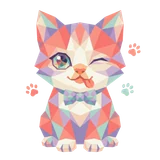

# 🐱 Meowth

## Profile

- Repository: [nocoo/meowth](https://github.com/nocoo/meowth)
- Website: No current website verified; navigation opens the repository.
- Website evidence: Not applicable
- Category: ai
- Archived repository: No; [repository status evidence](../sources/repository-status-2026-09-06.json)
- English: Local bridge for five coding-agent CLIs with HTTP control and a web dashboard
- Chinese: 把五种本机编程 Agent CLI 接入统一 HTTP 服务，并提供网页管理面板。
- Profile section: Recent Projects
- Profile revision: `880737d35ff74923cc0c96873fccf9e09ea5e569`
- Repository revision inspected: `15b4d902c71ec6184c7220f0fb50a29ca87e080d`

## Current logo

- Type: Original project artwork, copied without modification
- Subject: Multicolored faceted kitten with a bow tie and paw-print accents
- [Source](https://github.com/nocoo/meowth/blob/15b4d902c71ec6184c7220f0fb50a29ca87e080d/logo.png): `logo.png`
- [Preserved asset](../../public/logos/originals/meowth.png)
- Original dimensions: 2048 × 2048
- Original size: 3003934 bytes
- SHA-256: `13c60445ab61a9c54831af5a185d5c137b95a3c9abb672793250ceef29c33541`
- Locally modified source: No
- Display derivatives: 32, 64, 160, and 1024 px WebP; contain-fit, transparent padding, no recoloring or cropping.

## Current palette

| Role | Value | Evidence |
| --- | --- | --- |
| primary | `#3c83f6` | apps/dashboard/src/index.css :root --primary: 217 91% 60%, converted to sRGB |
| background | `#eeeff2` | apps/dashboard/src/index.css :root --background: 220 14% 94%, converted to sRGB |
| accent | `#1f1f1f` | apps/dashboard/src/index.css :root --foreground: 0 0% 12%, converted to sRGB |

Theme tokens take precedence. Additional colors are sampled from the preserved artwork. A transparent background means the source does not define an opaque background; the gallery's surrounding paper is not part of the project palette.

## Future family notes

Keep this asset as the phase-one baseline. A future family version should use a recognizable animal, one principal hue, and restrained multicolored geometric fragments.

Use head portraits for large animals and optionally full-body poses for small animals. Compare artwork, app icon, sidebar, and favicon sizes in both themes before adopting a replacement. No new logo is generated in phase one.
