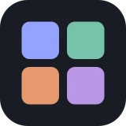

# 🗂️ Info Space

## Profile

- Repository: [nocoo/infospace](https://github.com/nocoo/infospace)
- Website: No current website verified; navigation opens the repository.
- Website evidence: Not applicable
- Category: tools
- Archived repository: No; [repository status evidence](../sources/repository-status-2026-09-06.json)
- English: Native SwiftUI workspace SDK with resizable grids and customizable information panels
- Chinese: 原生 SwiftUI 工作区 SDK，支持可调整的网格和自定义信息面板
- Profile section: Recent Projects
- Profile revision: `e3e92cf41ced9400940b18904f1c97453f3b5903`
- Repository revision inspected: `82f629ed42b6ec89dac0e0c79e2a63dec88ecacf`

## Project goal

Give macOS app developers a reusable SwiftUI workspace for arranging their own content in resizable panels. The SDK handles grid geometry, snapping and panel identity; the included demo shows the interactions with sample content kept only for the current session.

为 macOS 应用开发者提供可复用的 SwiftUI 工作区，把自己的内容放进可调整大小的面板。SDK 处理网格几何、吸附与面板身份；附带演示应用展示这些交互，示例内容仅在本次运行中保留。

- [中文 README](https://github.com/nocoo/infospace/blob/main/README.md) · [English README](https://github.com/nocoo/infospace/blob/main/docs/README.en.md)
- Verified: 2026-09-09; [source revision](https://github.com/nocoo/infospace/tree/0d25de0f63e20979fd81c1c295e5bc84132efb3a)
- Source files: [`Package.swift`](https://github.com/nocoo/infospace/blob/0d25de0f63e20979fd81c1c295e5bc84132efb3a/Package.swift), [`project.yml`](https://github.com/nocoo/infospace/blob/0d25de0f63e20979fd81c1c295e5bc84132efb3a/project.yml), [`Sources/InfoSpaceCore/InfoSpaceModel.swift`](https://github.com/nocoo/infospace/blob/0d25de0f63e20979fd81c1c295e5bc84132efb3a/Sources/InfoSpaceCore/InfoSpaceModel.swift), [`Sources/InfoSpaceUI/InfoSpaceCanvas.swift`](https://github.com/nocoo/infospace/blob/0d25de0f63e20979fd81c1c295e5bc84132efb3a/Sources/InfoSpaceUI/InfoSpaceCanvas.swift), [`Sources/InfoSpaceUI/InfoSpaceWindow.swift`](https://github.com/nocoo/infospace/blob/0d25de0f63e20979fd81c1c295e5bc84132efb3a/Sources/InfoSpaceUI/InfoSpaceWindow.swift), [`Sources/InfoSpaceUI/NativeWindowAttachment.swift`](https://github.com/nocoo/infospace/blob/0d25de0f63e20979fd81c1c295e5bc84132efb3a/Sources/InfoSpaceUI/NativeWindowAttachment.swift), [`Sources/InfoSpaceUI/InfoSpaceWorkspace.swift`](https://github.com/nocoo/infospace/blob/0d25de0f63e20979fd81c1c295e5bc84132efb3a/Sources/InfoSpaceUI/InfoSpaceWorkspace.swift), [`App/DemoPanelContent.swift`](https://github.com/nocoo/infospace/blob/0d25de0f63e20979fd81c1c295e5bc84132efb3a/App/DemoPanelContent.swift), [`scripts/check.sh`](https://github.com/nocoo/infospace/blob/0d25de0f63e20979fd81c1c295e5bc84132efb3a/scripts/check.sh)

### Tech stack

| Technology | Role | 用途 |
| --- | --- | --- |
| Swift | SDK and demo implementation with strict concurrency | SDK 与演示应用，启用严格并发检查 |
| SwiftUI | Reusable canvas, panels and workspace controls | 可复用画布、面板与工作区控件 |
| AppKit | Native macOS window integration | macOS 原生窗口集成 |
| Observation | Observable layout and panel state | 可观察的布局与面板状态 |
| Swift Package Manager | Core/UI libraries and compiled SDK examples | Core/UI 库与 SDK 示例编译 |
| XcodeGen | Generate the native demo app project | 生成原生演示应用工程 |
| Swift Testing | Layout, identity and geometry tests | 布局、身份与几何测试 |

## Current logo

- Type: Original project artwork, copied without modification
- Subject: Indigo metal information tray with adjustable dividers and four colored paper stacks
- [Source](https://github.com/nocoo/infospace/blob/82f629ed42b6ec89dac0e0c79e2a63dec88ecacf/logo.png): `logo.png`
- [Preserved asset](../../public/logos/originals/infospace-family-2026-09-09-01-01.png)
- Original dimensions: 2048 × 2048
- Original size: 4365206 bytes
- SHA-256: `3b2e9aaead0eddccf8bf2212fe96f5ed207a06dc6111f72a829dd2db0a656772`
- Locally modified source: No
- Display derivatives: 32, 64, 160, and 1024 px WebP; contain-fit, transparent padding, no recoloring or cropping.

## Current palette

| Role | Value | Evidence |
| --- | --- | --- |
| primary | `#ffffff` | Sources/InfoSpaceUI/InfoSpaceStyle.swift: InfoSpaceTheme.dark.accent = .white |
| background | `#13161c` | Sources/InfoSpaceUI/InfoSpaceStyle.swift: InfoSpaceTheme.dark.background, sRGB (0.075, 0.085, 0.11), rounded to 8-bit channels |
| accent | `#373e55` | Native InfoSpace f35f20b193b2, sampled sRGB pixel (1040, 1540); artwork/logo-family/infospace/2026-09-09-01/palette.json |
| accent | `#c1b6b1` | Native InfoSpace f35f20b193b2, sampled sRGB pixel (1265, 810); artwork/logo-family/infospace/2026-09-09-01/palette.json |
| accent | `#5f6da3` | Native InfoSpace f35f20b193b2, sampled sRGB pixel (700, 700); artwork/logo-family/infospace/2026-09-09-01/palette.json |
| accent | `#689088` | Native InfoSpace f35f20b193b2, sampled sRGB pixel (1420, 650); artwork/logo-family/infospace/2026-09-09-01/palette.json |
| accent | `#d8815c` | Native InfoSpace f35f20b193b2, sampled sRGB pixel (760, 1050); artwork/logo-family/infospace/2026-09-09-01/palette.json |
| accent | `#9d7ca8` | Native InfoSpace f35f20b193b2, sampled sRGB pixel (1450, 1100); artwork/logo-family/infospace/2026-09-09-01/palette.json |

Theme tokens take precedence. Additional colors are sampled from the preserved artwork. A transparent background means the source does not define an opaque background; the gallery's surrounding paper is not part of the project palette.

## Refined identity

- Status: Adopted in the source project; updated 2026-09-09.
- Study `2026-09-09-01`, finishing `01`
- Refined subject: Indigo metal information tray with adjustable dividers and four colored paper stacks
- Site path: `/projects/infospace#brand`; [local gallery](https://index.dev.hexly.ai/projects/infospace#brand)
- [Static review HTML](../../artwork/logo-family/infospace/2026-09-09-01/review.html)
- [Full process archive](https://github.com/nocoo/hexly.ai/tree/main/artwork/logo-family/infospace/2026-09-09-01)
- [Transparent foreground](../../public/logos/family/infospace/2026-09-09-01/01/transparent.png); SHA-256: `3b2e9aaead0eddccf8bf2212fe96f5ed207a06dc6111f72a829dd2db0a656772`
- [Square icon](../../public/logos/family/infospace/2026-09-09-01/01/icon.png), [rounded icon](../../public/logos/family/infospace/2026-09-09-01/01/rounded.png), [white version](../../public/logos/family/infospace/2026-09-09-01/01/white.png)
- [Untouched generation](../../public/logos/family/infospace/2026-09-09-01/01/raw.png), [exact prompt](../../public/logos/family/infospace/2026-09-09-01/01/prompt.txt), [public asset checksums](../../public/logos/family/infospace/2026-09-09-01/01/manifest.json)
- [Previous original](../../public/logos/originals/infospace.svg), copied from [its immutable source](https://github.com/nocoo/infospace/blob/0d25de0f63e20979fd81c1c295e5bc84132efb3a/logo.svg)
- Previous SHA-256: `7540789c41a74c8553af6fe38b23aa3784753259038ff93dc8e7797f17582d03`
- Generation: gpt-image-2, native 2048 × 2048; transparent extraction and presentation are separate finishing steps.
- The finishing archive includes transparent, square, and rounded PNGs at 2048, 1024, 512, 256, 128, 64, 48, 32, 24, and 16 px.
- Application previews use the refined square icon without extra padding, backgrounds, or circular masks. Artwork previews and downloads use its own transparent foreground, independently of the preserved source logo above.

### Refined palette

| Role | Value | Evidence |
| --- | --- | --- |
| background | `#c6cddd` | Selected InfoSpace presentation, 2026-09-09-01/01; background.base in archived settings.json |
| primary | `#373e55` | Native InfoSpace f35f20b193b2, sampled sRGB pixel (1040, 1540); artwork/logo-family/infospace/2026-09-09-01/palette.json |
| accent | `#c1b6b1` | Native InfoSpace f35f20b193b2, sampled sRGB pixel (1265, 810); artwork/logo-family/infospace/2026-09-09-01/palette.json |
| accent | `#5f6da3` | Native InfoSpace f35f20b193b2, sampled sRGB pixel (700, 700); artwork/logo-family/infospace/2026-09-09-01/palette.json |
| accent | `#689088` | Native InfoSpace f35f20b193b2, sampled sRGB pixel (1420, 650); artwork/logo-family/infospace/2026-09-09-01/palette.json |
| accent | `#d8815c` | Native InfoSpace f35f20b193b2, sampled sRGB pixel (760, 1050); artwork/logo-family/infospace/2026-09-09-01/palette.json |
| accent | `#9d7ca8` | Native InfoSpace f35f20b193b2, sampled sRGB pixel (1450, 1100); artwork/logo-family/infospace/2026-09-09-01/palette.json |

### Adjustable compartments

One sliding divider separates four unequal bays. The larger terracotta paper stack shows how space can be allocated while the complete tray remains one compact object.

滑动隔板分出四个大小不同的区域，较大的陶土色纸卡区体现空间分配，完整托盘形成紧凑的整体。

### Metal and paper

An indigo anodized frame, brushed-metal fittings and matte paper stacks make the adjustable workspace tangible. Continuous material shading preserves the frame, reflections and paper edges.

靛蓝阳极氧化边框、拉丝金属配件与哑光纸卡，把可调整的工作区转化为实物。连续的材质明暗保留边框、反光和纸张边缘。

### Adjustable spaces

Offset panel outlines and short alignment ticks sit on cool indigo-gray paper. The field, grain and projected shadows are separate layers, so the small application mark stays transparent.

冷靛灰纸面上排列错位的面板轮廓和短对齐刻线。底色、颗粒与投影独立保存，小尺寸应用标记使用透明图。

Small-size observation: At 128/64 px, the four compartments and central divider remain distinct. At 32/24/16 px, the divided silhouette and four colors carry recognition; paper grain, metal texture and the adjustment slot merge. The native toolbar uses a 22 pt transparent mark.

## Further refinements

This is an owner-directed physical material or architectural identity. Preserve its physical materials, complete silhouette, selected camera and distinct tonal presentation. The animal-series drawing and accessory rules do not apply.

Keep the complete object uniformly inset from the actual rounded outline, with backgrounds, projected shadows and any external emission separate from the transparent foreground. Compare artwork, app icon, sidebar, and favicon sizes in both themes before adopting a replacement. Preserve this reviewed composition and its archived predecessors.
