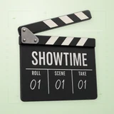

# 🎬 Showtime

## Profile

- Repository: [nocoo/showtime](https://github.com/nocoo/showtime)
- Website: No current website verified; navigation opens the repository.
- Website evidence: Not applicable
- Category: tools
- Archived repository: No; [repository status evidence](../../docs/sources/showtime-2026-09-10.json)
- English: Native macOS browser for agent-directed product demo recordings
- Chinese: 原生 macOS 演示浏览器，由 Agent 编排网页交互并录制产品演示
- Profile section: Recent Projects
- Profile revision: `73203ef18b98ccf7cf03be7ef0ebf327bb8a743d`
- Repository revision inspected: Initial source commit pending; see the local snapshot above

## Project goal

Turn scripted interactions with real webpages into product demo movies on macOS. Agents can direct pointer movement, clicks, typing, camera zoom and animated captions through JSON scripts, a CLI or MCP; the native browser exports MP4 without an audio track.

把真实网页上的脚本化交互制作成 macOS 产品演示视频。Agent 可通过 JSON 剧本、CLI 或 MCP 编排鼠标移动、点击、输入、镜头缩放和动态字幕，原生浏览器将演示导出为不含音轨的 MP4。

- Verified: 2026-09-10; [preserved local source snapshot](../../docs/sources/showtime-2026-09-10.json)
- Snapshot SHA-256: `df845adc492a9f79c1a4df4089f060986991704e6ecad5684b2a2d9b1e751949`
- Source files: `README.md`, `Package.swift`, `Sources/Showtime/App/StudioView.swift`, `Sources/Showtime/App/StudioModel.swift`, `Sources/Showtime/Browser/BrowserEngine.swift`, `Sources/Showtime/Director/Director.swift`, `Sources/Showtime/Recording/MovieRecorder.swift`, `Sources/ShowtimeCore/Script.swift`, `scripts/showtime_cli.py`, `scripts/showtime_mcp.py`, `scripts/make_icon.swift`
- The source repository has no inspected commit yet. README publication and immutable repository links are deferred.

### Tech stack

| Technology | Role | 用途 |
| --- | --- | --- |
| Swift | Native application and typed script execution | 原生应用与类型化脚本执行 |
| SwiftUI / AppKit | macOS studio, inspector and window integration | macOS 演播室、检查器与窗口集成 |
| WebKit | Real webpages and browser interaction | 真实网页渲染与浏览器交互 |
| AVFoundation | Frame composition and MP4 export | 画面合成与 MP4 导出 |
| Python | Command-line client and MCP server | 命令行客户端与 MCP 服务器 |
| JSON / MCP | Declarative choreography and agent tools | 声明式演示编排与 Agent 工具 |

## Current logo

- Type: Original project artwork, copied without modification
- Subject: Initial purple browser/play identity retained as source evidence while the approved classic clapperboard is applied by the Showtime Codex
- [Source](../../public/logos/originals/showtime-initial.png): `.build/Showtime.iconset/icon_512x512@2x.png`
- [Preserved asset](../../public/logos/originals/showtime-initial.png)
- Original dimensions: 1024 × 1024
- Original size: 528759 bytes
- SHA-256: `8fe319552849e04934273d30a10b9bc1fc68ae94bb08182b5d372511e12feef9`
- Locally modified source: No
- Display derivatives: 32, 64, 160, and 1024 px WebP; contain-fit, transparent padding, no recoloring or cropping.

## Current palette

| Role | Value | Evidence |
| --- | --- | --- |
| primary | `#4a8234` | Sources/Showtime/App/StudioView.swift: Theme.accentHex = #4A8234; docs/sources/showtime-2026-09-10.json |
| background | `#f6f8f4` | Sources/Showtime/App/StudioView.swift: Theme.surface, sRGB (246, 248, 244) |
| accent | `#cfe8b5` | Sources/Showtime/App/StudioView.swift: Theme.sprout, sRGB (207, 232, 181) |

Theme tokens take precedence. Additional colors are sampled from the preserved artwork. A transparent background means the source does not define an opaque background; the gallery's surrounding paper is not part of the project palette.

## Refined identity

- Status: Local review; this finishing pass has not been adopted in the source project; updated 2026-09-10.
- Study `2026-09-10-02`, finishing `03`
- Refined subject: Classic black-and-white clapperboard with SHOWTIME lettering, numbered production fields and a brushed-metal hinge
- Site path: `/logos/showtime`; [local gallery](https://index.dev.hexly.ai/logos/showtime)
- [Static review HTML](../../artwork/logo-family/showtime/2026-09-10-02/review.html)
- [Full process archive](https://github.com/nocoo/hexly.ai/tree/main/artwork/logo-family/showtime/2026-09-10-02)
- [Transparent foreground](../../public/logos/family/showtime/2026-09-10-02/03/transparent.png); SHA-256: `2e797a60a6349ee2cc62ee7c238dd41eeb7bf169af328375e090b66954400704`
- [Square icon](../../public/logos/family/showtime/2026-09-10-02/03/icon.png), [rounded icon](../../public/logos/family/showtime/2026-09-10-02/03/rounded.png), [white version](../../public/logos/family/showtime/2026-09-10-02/03/white.png)
- [Untouched generation](../../public/logos/family/showtime/2026-09-10-02/03/raw.png), [exact prompt](../../public/logos/family/showtime/2026-09-10-02/03/prompt.txt), [public asset checksums](../../public/logos/family/showtime/2026-09-10-02/03/manifest.json)
- [Previous original](../../public/logos/originals/showtime-initial.png), copied from [its preserved local source](../../public/logos/originals/showtime-initial.png)
- Previous SHA-256: `8fe319552849e04934273d30a10b9bc1fc68ae94bb08182b5d372511e12feef9`
- Generation: gpt-image-2, native 2048 × 2048; transparent extraction and presentation are separate finishing steps.
- The finishing archive includes transparent, square, and rounded PNGs at 2048, 1024, 512, 256, 128, 64, 48, 32, 24, and 16 px.
- Application previews use the refined square icon without extra padding, backgrounds, or circular masks. Artwork previews and downloads use its own transparent foreground, independently of the preserved source logo above.

### Refined palette

| Role | Value | Evidence |
| --- | --- | --- |
| background | `#dce8d1` | Designed presentation; artwork/logo-family/showtime/2026-09-10-02/presentation.json, finishing 03. Kept separate from native artwork and application theme tokens. |
| primary | `#2b2b2b` | Native Showtime 0ff9ef4fa0f6, sRGB pixel (1080, 920); artwork/logo-family/showtime/2026-09-10-02/palette.json |
| accent | `#ede6de` | Native Showtime 0ff9ef4fa0f6, sRGB pixel (1000, 390); artwork/logo-family/showtime/2026-09-10-02/palette.json |
| accent | `#e4dddc` | Native Showtime 0ff9ef4fa0f6, sRGB pixel (850, 1250); artwork/logo-family/showtime/2026-09-10-02/palette.json |
| accent | `#8c8685` | Native Showtime 0ff9ef4fa0f6, sRGB pixel (500, 500); artwork/logo-family/showtime/2026-09-10-02/palette.json |
| accent | `#61bb46` | Owner-requested green design anchor used only by the separate background motif at 30% opacity; presentation.json. |

### Just before the clap

A raised upper stick and broad, mostly frontal slate form one compact object. The complete hinge and corners remain visible, with 178.5 px of clearance against the final rounded outline.

抬起的上板与接近正面的宽阔板面构成紧凑整体，铰链和所有边角保持完整，与最终圆角边界至少相距 178.5 px。

### Black slate, real lettering

Matte charcoal, ivory diagonal inlays and brushed silver preserve the classic physical slate. SHOWTIME and ROLL / SCENE / TAKE markings belong to the object; every fully opaque extracted native pixel retains its original RGB.

哑光炭黑、象牙白斜条与拉丝金属保留经典实物质感，SHOWTIME 和 ROLL / SCENE / TAKE 文字印在板面上；提取后所有完全不透明的原生像素均保持原 RGB。

### Green film registration

Sparse film-gate brackets, perforation marks and editing cues sit on pale sage paper. Green stays in the independent background and soft shadows; the small interface mark uses the transparent board.

浅鼠尾草绿纸面搭配稀疏的取景定位线、胶片齿孔和剪辑标记。绿色留在独立底纹与柔和投影里，小尺寸界面标记使用透明场记板。

Small-size observation: The title and three production fields read at large sizes. At 32/24/16 px, the lifted striped stick and slate silhouette carry recognition; the small field labels and material grain merge. Sidebar and browser specimens show identity scale; Showtime itself is a native macOS app.

## Further refinements

This is an owner-directed physical material or architectural identity. Preserve its physical materials, complete silhouette, selected camera and distinct tonal presentation. The animal-series drawing and accessory rules do not apply.

Keep the complete object uniformly inset from the actual rounded outline, with backgrounds, projected shadows and any external emission separate from the transparent foreground. Compare artwork, app icon, sidebar, and favicon sizes in both themes before adopting a replacement. Preserve this reviewed composition and its archived predecessors.
