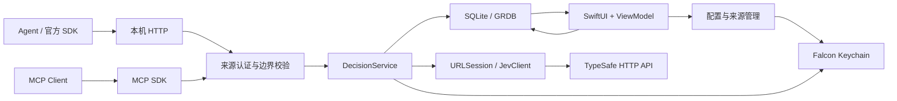

# 02 · 架构与数据

状态：推荐方案；运行时 SDK 与留存语义待用户确认，见 [01](01-product.md)。

## 一个应用进程，两个入口，一条决策管线

HTTP 和 MCP 只负责协议映射；业务管线不依赖 SwiftUI。UI 直接观察本进程的数据服务，不绕行 localhost，也不增加一个可被来源 key 访问的管理 API。

应用最小划分为 `FalconCore` 与 `Falcon` 两个 target。Core 包含类型、认证、决策服务与存储；App target 包含 SwiftUI / AppKit 和生命周期。内部按目录模块化，不提前拆成大量 package 或单实现协议。

## 技术选型及理由

| 层 | 建议 | 理由与边界 |
| --- | --- | --- |
| UI | SwiftUI、Observation、Swift Charts；必要时 AppKit | 原生窗口、表格、图表和可访问性；MVVM 分离展示与业务 |
| 上游调用 | Foundation URLSession + Codable | 官方公开 HTTP 接口仅一条推理路径；不内置 Python / Node；官方 SDK作互操作基准 |
| HTTP server | Hummingbird 2.x | 已检查文档与类型入口，复用成熟 HTTP framing、请求体限制和生命周期；不手写 Network.framework HTTP 解析器 |
| MCP | 官方 Swift SDK 0.12.1 的 `StatelessHTTPServerTransport` | 已核实 tag 中存在；JSON 请求响应即可满足 Jev，不需要 SSE 推送和 session 存储 |
| 持久化 | GRDB + 系统 SQLite，WAL | 事务、查询、迁移和观察机制降低手写 C API 管理成本；不打包第二份数据库引擎 |
| 凭据 | Security.framework / Keychain；CryptoKit 摘要 | 上游密钥只在 Falcon 自有 namespace；内部 key 数据库仅保存 SHA-256 摘要 |
| 并发 | Swift concurrency、actor、结构化任务 | ViewModel 在 MainActor；网络、数据库、正文解析均不阻塞主线程 |
| 构建 | Xcode app target + 本地 Swift package | 正常签名与资源打包；SPM pin 依赖，Release 开启优化与 dead stripping |

初始只有三项直接 Swift 包依赖：Hummingbird、MCP、GRDB。传递依赖和最终二进制体积必须实测，不能用“三个包”代替体积证据。UI 不引入 WebView、第三方动画框架、自定义字体或大型纹理包。实现前锁定可共同构建的正式版本，不能依赖浮动 main；本轮未做编译证明。

## 运行生命周期

- 第一次启动先配置上游与来源；未配置时服务状态为 `Needs setup`，不宣称 ready。
- 服务绑定建议 `127.0.0.1:19823`，端口可在设置修改；端口未经占用检测，实施时必须检测，冲突显示实际错误，不能静默换端口。首版只支持 IPv4 数字地址，接入配置不使用可能解析到 IPv6 的 localhost。
- 窗口关闭后主进程和 MenuBarExtra 保持运行；Dock / 菜单栏可重新打开同一主窗口。Quit 明确停止服务。登录启动可选、默认关闭。
- Pause 停止接收新的推理请求，返回 503；已有任务在原截止时间内完成。Quit 最多等待 5 秒，再取消本地任务并记为 interrupted / unknown；取消不保证上游未计费。
- 睡眠、断网、凭据不可用、端口冲突和磁盘错误分别展示，不合并成“Offline”。睡醒后先做留存清理，再重新接收推理。
- 启动先恢复数据库、清理过期记录；把未完成记录标成 interrupted，不自动重试。禁止两个进程同时服务同一数据库；启动第二实例只激活已有窗口。

## 请求生命周期与一致性

1. 读取请求头并验证 host / origin / key；检查流式读取上限和并发配额。
2. 生成独立 UUID `request_id`，验证 JSON 和 Jev 类型契约；由同一个配置 actor 一次取得 source/key ID、profile revision、最终 URL、模型与对应凭据的不可变执行快照。凭据读取完成前不得放行；快照内的 secret 仅留在内存，禁止重新从“当前 profile”补读。
3. 在全局存储 admission actor 中原子预留本次完整审计空间，再事务写入 received/effective request 与 `accepted` 记录。预留或事务失败则返回本地 507，不发送上游。
4. 标记 `in_flight`，通过唯一 JevClient 发出一次调用。全程最多 30 秒，不自动 retry。
5. 接收并校验响应，单事务写入终态、response、题目投影与 usage，再将结果返回调用方。
6. 通过数据库观察驱动 UI；列表只读取摘要，选中后读取正文。列表更新最多每 250 ms 合并一次，不延迟协议响应。

终态分为 `succeeded`、`rejected`、`upstream_error`、`transport_error`、`timed_out`、`cancelled`、`interrupted`、`invalid_response`。`accepted/in_flight` 是非终态；本地校验拒绝不算上游失败。鉴权成功但 JSON 无效的请求保留有界原文及拒绝原因；未鉴权流量只做有界诊断计数，不保存正文，也不归属任意来源。

请求体读取失败或超过大小上限时，只存拒绝元数据和“正文未完整接收”，不能把截断内容标为完整请求。统计明确区分接收、接受、已转发和已完成。

**记录可靠性优先**：发送上游前必须落盘；响应落盘后才返回成功。若上游已执行而终态落盘失败，返回 `falcon_audit_unavailable`（507，结果与计费可能已发生），停止新推理并在 UI 显示存储故障。保留已提交的 in-flight 记录，恢复后标记为 unknown/interrupted。不能承诺进程崩溃或磁盘故障下百分之百拿到上游结果，也不能自动补发。

**交付状态独立**：`succeeded` 只表示 Jev 成功且记录成功；HTTP 写回失败另存 `delivery=failed/unknown`。正常写回也仅是 `delivery=written`，不声称 Agent 已读取或执行。

### 回看所需的时间事实

每条 request 以 HTTP 请求头接收时的 UTC `received_at` 和内存中的单调时钟为起点。持久化相对起点的毫秒 offset：`body_received_ms`（客户端正文完整收到）、`upstream_started_ms`、`response_received_ms`（上游 body 完整收到）、`terminal_ms`（校验/处理结束，终态事务提交前）、`delivery_finished_ms`（本地响应写回完成）。实际未发生或无法确认的阶段为 null；崩溃恢复不以恢复时刻补写历史终点。完整输入只能在 body_received_ms 对应事件后揭示；超限/断开等正文不完整情况始终标为不完整。

body_received_ms 随 received/effective request 的 accepted 事务落盘，后续已知 offset 随对应状态更新及终态/原文提交；不能仅在内存记录已发生的阶段，再把崩溃后的恢复时间当作阶段事实。返回完成只能在写回结束后另做有界的元数据更新，失败时保留已提交的响应与 unknown delivery/timing，不能把缺失值当零，也不因此重新发上游。`terminal_ms` 不含最后一次审计提交及下游写回，UI 将其标为“代理处理耗时”；`delivery_finished_ms` 才是“返回总耗时”，也仅证明本地写回完成。返回时刻从 received_at + offset 推导并标明本机观测，墙钟变化时附异常标记。

本地准备 = upstream_started_ms；上游往返 = response_received_ms − upstream_started_ms；收尾处理 = terminal_ms − response_received_ms；处理总耗时 = terminal_ms；返回总耗时 = delivery_finished_ms。差值仅在两端存在时计算；上游等待含网络与服务处理，不标成 Jev 内部推理耗时。批量问题共用 request 时间，不分摊出逐题耗时。回放只消费这些字段，规则见 [08](08-review-playback.md)。

## 数据模型

| 表 / 实体 | 关键字段与规则 |
| --- | --- |
| `upstream_profiles` | UUID、名称、base URL、default model、keychain reference、revision、enabled；不保存明文 key |
| `sources` | UUID、名称、profile ID、enabled、archived、created_at；source ID 永不复用 |
| `source_keys` | UUID、source ID、token digest、display suffix、created_at、revoked_at；同一来源只有一把 active key |
| `requests` | UUID、source/key ID、来源名称快照、profile ID/revision/base URL 快照、transport、caller metadata、received_at、expires_at、status、delivery、requested/resolved model、五个 nullable 阶段 offset、HTTP 状态、错误分类、token nullable、`received_request` / `effective_request` / `upstream_response` 三个独立 BLOB |
| `questions` | request ID + question ID 联合主键，type、结果摘要、confidence nullable、top probability、margin nullable；用于筛选的投影，不重复保存 state |
| `reviews` | request ID 唯一外键、state、note、updated_at；与 request 级联删除 |

原始 JSON 是证据来源，投影可重建；不因为未知字段而丢失原文。`received_request` 是收到的 HTTP JSON 或完整 MCP JSON-RPC body；`effective_request` 是真正送上游的 JSON（包含补齐的默认 model），`upstream_response` 是上游原文；未发上游/无响应时对应列 nullable，不能伪造空成功对象。三列、投影和 review 同时到期。不单独复制全文到 FTS、日志、诊断报告或分析服务。备注上限 4 KiB；source/profile 名称上限 120 字符；caller metadata 序列化上限 4 KiB。

索引以 `(received_at, id)`、`(source_id, received_at, id)`、`(status, received_at, id)`、`(profile_id, received_at, id)` 与 question 类型/置信度为起点，根据 query plan 添加必要索引。列表使用游标分页，每页 100；正文按需读，不把全库解码到内存。首版全文关键词搜索在时间和元数据筛选后执行有界、可取消的扫描；不许仅扫描当前页而显示为全库结果。

上游 profile 被归档后禁止新调用，来源必须重新绑定或禁用。修改 profile 不改写历史快照；显示当前名称时保留历史名称入口。不持久化 key 明文或能还原密钥的历史快照。

**配置启用事务**：编辑先写新的、版本独立的 Falcon Keychain item，再由同一个配置 actor 提交完整 profile 新版本并原子切换 active revision；任一步失败保留旧配置，清理未引用的新 item。接收请求的 actor 在允许配置切换前取得整体执行快照（含对应 secret 的内存引用），因此不会把旧 URL 与新 key 配对。旧 Keychain item 及已捕获 secret 的引用保留到使用旧版本的在途任务释放，随后仅删除 Falcon 自有旧 item；重启清理未引用 item 时也只按自身 namespace 和记录检查。版本回收不是旧 key 的调用宽限期，新请求只用 active revision。

## 七天留存与容量

- `expires_at = received_at + 604800 秒`，UTC 持久化；用户 UI 使用本地时区。这里是滚动 168 小时，不是七个日历日。
- 每次列表、详情、搜索、统计、导出和回放都强制 `expires_at > now`，这里的 now 永远是当前真实时钟，不是回放游标。恰好到期即不可见；已打开详情及回放缓存到期时清空并显示已过期。request、questions、review 同生命周期，无永久汇总绕过留存。
- 启动、唤醒和每分钟清理批量删除过期记录；清理失败进入存储故障，不继续积累调用。睡眠/退出期间无法物理删除，恢复后先清理再服务。
- SQLite 启用 secure delete；清理后在无长事务时 checkpoint WAL 并 truncate。控制读事务寿命，防止旧页在 WAL 长期保留。说明这是应用逻辑清理，不保证 SSD、快照或用户外部备份的物理擦除。
- 数据目录 `~/Library/Application Support/Falcon/`，目录 0700、DB / WAL / SHM 0600，排除系统备份；只操作自己的目录。正文默认本地明文存储，依赖当前用户权限与系统磁盘保护，不声称有应用级加密。
- 初始受管存储预算 2 GiB（DB + WAL + SHM）。唯一 admission actor 维护全局在途预留总账，原子执行 `physical_bytes + outstanding_reservations + new_reservation <= budget` 检查与预留；同时检查文件系统可用空间并保留至少 256 MiB 系统余量。所有写入者（含 review、配置、拒绝记录）都走同一总账，不能分别看到相同空闲空间后超发。
- `new_reservation` 包含两份请求体、最大 4 MiB response、由已验证题目数量/字段长度算出的投影与索引上界、SQLite 页对齐/分裂余量，以及这些页写入 DB 和 WAL 的双份增长预算。计算公式与最大合法输入压力 fixture 同时实现并验证，不把 JSON 字节数直接当磁盘增长。无法证明本次上界就拒绝，不先转发。请求完成/失败/取消后，在落盘结束并重新采样文件大小时释放预留；按 request ID 只释放一次。已消耗部分继续计入预留会保守降低可用量，但不得过早释放正在提交的空间。
- 达到预算先清理过期记录、checkpoint，并用建库时启用的 incremental auto-vacuum 逐批回收空闲页；仍不足返回 507，不提前删未满 7 天的数据，不静默只留摘要。存储不足时拒绝计数只放有界内存，不继续写满数据库。UI 显示容量与拒绝状态。外部进程耗尽磁盘仍可能导致已预留写入失败，按前述审计故障路径处理，预留不等于操作系统磁盘保证。
- HTTP 请求体上限 1 MiB，上游响应上限 4 MiB；最多 8 个全局、每来源 2 个推理在途；超限立即拒绝，不设置无限队列。全部是 Falcon 本地保护值，不冒充 TypeSafe 限额。
- 系统时钟跳变会影响墙钟留存；耗时一律使用单调时钟。前跳不恢复已删除数据；后跳可能推迟物理到期，UI 的时间范围以当前 UTC 计算并显示检测到的时钟变化。

手动清空停止接收、等待在途排空或取消后，在事务中删除历史与 review、清空 UI 缓存并 checkpoint；结束后恢复服务。不能在删除后让迟到回调把旧记录重新写回。用户导出的文件不受自动七天清理管理，导出时明确这一点。

## 统计定义

统计与列表共享筛选和截止时间，在同一 read snapshot 中计算，图表点击只改变筛选，不改变数据。

| 指标 | 定义 |
| --- | --- |
| 请求数 | 所选范围内已认证且记录成功的推理请求，含本地拒绝；MCP initialize / tools/list 等不计为推理 |
| 题数 | 合法请求的 questions 数量，单列完成题数；无效 JSON 不猜题数 |
| 错误率 | 所选已终结请求中失败数 / 已终结请求数；UI 给分母，运行中单列 |
| 上游成功率 | 成功响应数 / 已转发且已终结数；本地拒绝不进入分母 |
| Token | 对有 usage 的 request 分别求 input/output 和；标注 usage 未知的请求数，不按题拆分 |
| 耗时 | 本地准备、上游往返、收尾、处理总耗时和返回总耗时分别标注；默认 p50/p95 用已终态且 terminal_ms 已知的处理总耗时，返回视图只用 delivery=written 且 delivery_finished_ms 已知的样本，明确名称、分母及缺失数；最近秩法 `ceil(p*n)`，不平均各来源 percentile |
| 置信度 | 只统计返回合法 confidence 的 Choice / Score，按题计数；Noul 单独展示 yes 概率 |
| 决策分布 | 只对同题型、同 instructions/criteria 内容指纹的题分组，避免同名 question ID 语义混淆 |
| 金额 | 首版不显示伪精确费用；官方账单未接入，只展示 token。后续有明确费率与版本才做“估算” |

时间序列按 UTC 固定桶计算、本地格式化，夏令时重复小时附 UTC offset。无样本显示破折号，缺失 usage 不补零。手动清空会同步影响所有统计。

[下一篇：协议](03-protocol.md) · [目录](README.md)
